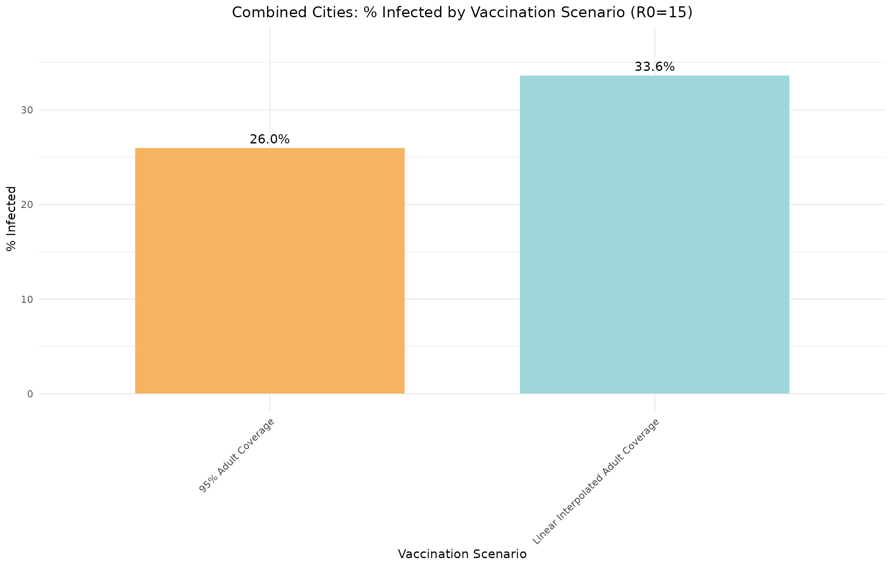

# Combined City Population: Measles Outbreak Modeling

``` r
library(multigroup.vaccine)
library(socialmixr)
library(ggplot2)

# Load city data files
hildale_path <- system.file("extdata", "hildale_ut_2023.csv", package = "multigroup.vaccine")
colorado_city_path <- system.file("extdata", "colorado_city_az_2023.csv", package = "multigroup.vaccine")
```

## Measles Model Setup

For measles outbreak modeling in the combined population of Hildale, UT
and Colorado City, AZ, we’ll use granular age groups that separate
school levels: pre-school (0-4), elementary (5-12), middle school
(13-14), high school (15-18), and adult age bands.

``` r
# Age groups: 0-4, 5-11 (elementary K-6), 12-13 (middle 7-8), 14-17 (high 9-12), 18-24, 25-34, 35-44, 45-54, 55-64, 65+
agelims <- c(0, 5, 12, 14, 18, 25, 35, 45, 55, 65)

# Vaccine effectiveness by age group
ageveff <- rep(0.97, length(agelims))  # All groups have high effectiveness
ageveff[1] <- 0.93  # Under 5 may have slightly lower effectiveness

# Initial infection in the 25-29 age group (working age adults)
# This corresponds to age group 25-34 (index 6)
initgrp <- 6
```

## Getting Combined City Population Data

We’ll combine the populations of Hildale, UT and Colorado City, AZ by
disaggregating their ACS 5-year age groups into single-year ages, then
summing across both cities, and finally aggregating into school age
groups.

``` r
# Get single-year age data for both cities
cities <- c("Hildale city, Utah", "Colorado City town, Arizona")
city_paths <- c(hildale_path, colorado_city_path)

single_year_data <- list()

for (i in seq_along(cities)) {
  data <- getCityData(
    city_name = cities[i],
    csv_path = city_paths[i],
    age_groups = NULL  # Single-year ages
  )
  single_year_data[[cities[i]]] <- data
}

# Combine populations by summing across cities for each age
combined_ages <- single_year_data[[1]]$age_pops * 0  # Initialize with zeros
age_labels <- single_year_data[[1]]$age_labels
total_pop <- 0

for (city_data in single_year_data) {
  combined_ages <- combined_ages + city_data$age_pops
  total_pop <- total_pop + city_data$total_pop
}

# Now aggregate into school age groups
ages_numeric <- 0:85  # Ages 0 through 85
grouped <- aggregateByAgeGroups(ages_numeric, combined_ages, agelims)
#> Aggregating ages 0 to 4: sum = 182
#> Aggregating ages 5 to 11: sum = 569.4
#> Aggregating ages 12 to 13: sum = 246.4
#> Aggregating ages 14 to 17: sum = 504.2
#> Aggregating ages 18 to 24: sum = 677
#> Aggregating ages 25 to 34: sum = 543
#> Aggregating ages 35 to 44: sum = 341
#> Aggregating ages 45 to 54: sum = 468
#> Aggregating ages 55 to 64: sum = 263

combined_data <- list(
  city = "Combined Hildale, UT and Colorado City, AZ",
  year = 2023,
  total_pop = total_pop,
  age_pops = grouped$pops,
  age_labels = grouped$labels,
  data = NULL  # No single data frame for combined
)

cat("Combined Population Data:\n")
#> Combined Population Data:
cat("Total population:", format(combined_data$total_pop, big.mark = ","), "\n")
#> Total population: 3,899
cat("Age distribution:\n")
#> Age distribution:
for (i in seq_along(combined_data$age_labels)) {
  pct <- 100 * combined_data$age_pops[i] / combined_data$total_pop
  cat(sprintf("  %s: %s (%.1f%%)\n",
              combined_data$age_labels[i],
              format(combined_data$age_pops[i], big.mark = ","),
              pct))
}
#>   0to4: 182 (4.7%)
#>   5to11: 569.4 (14.6%)
#>   12to13: 246.4 (6.3%)
#>   14to17: 504.2 (12.9%)
#>   18to24: 677 (17.4%)
#>   25to34: 543 (13.9%)
#>   35to44: 341 (8.7%)
#>   45to54: 468 (12.0%)
#>   55to64: 263 (6.7%)
#>   65plus: 105 (2.7%)
```

## Scenario 1: Current Vaccination Coverage (95% adult rate)

Let’s model outbreaks under estimated vaccination coverage levels for
the combined community.

``` r
# Vaccination coverage rates
# Assume 95% coverage for adults (19+), lower for children
vaxcov <- c(
  0.44,  # under 5
  0.45,  # 5-11 elementary
  0.50,  # 12-13 middle
  0.45,  # 14-17 high
  0.95,  # 18-24
  0.95,  # 25-34
  0.95,  # 35-44
  0.95,  # 45-54
  0.95,  # 55-64
  0.95   # 65+
)

current_coverage_95 <- vaxcov  # For compatibility with interpolation code
```

``` r
# Run the measles model using getOutputTable
results1 <- getOutputTable(
  agelims = agelims,
  agepops = combined_data$age_pops,
  agecovr = vaxcov,
  ageveff = ageveff,
  initgrp = initgrp
)

cat("Combined Cities - Current Vaccination Coverage\n")
#> Combined Cities - Current Vaccination Coverage
print(as.data.frame(results1), row.names = FALSE)
#>  R0  R0local       Rv pEscape escapeInfTot under5 5to11 12to13 14to17 18to24
#>  10 20.61422 10.82586   0.640          988     97   320    126    284     49
#>  11 22.67564 11.90844   0.646          996     99   320    126    284     50
#>  12 24.73706 12.99103   0.681         1001    101   320    126    284     51
#>  13 26.79848 14.07361   0.682         1006    103   320    126    284     51
#>  14 28.85990 15.15620   0.743         1010    104   320    126    284     52
#>  15 30.92132 16.23879   0.715         1013    105   320    126    284     52
#>  16 32.98274 17.32137   0.741         1015    106   320    126    284     52
#>  17 35.04417 18.40396   0.749         1017    106   320    126    284     52
#>  18 37.10559 19.48654   0.764         1019    107   320    126    284     53
#>  25to34 35to44 45to54 55to64 65+
#>      37     25     31     14   4
#>      38     25     32     15   4
#>      39     26     33     16   4
#>      40     26     34     16   5
#>      41     26     35     17   5
#>      41     26     35     17   5
#>      42     27     35     18   5
#>      42     27     36     18   5
#>      42     27     36     18   6

# Extract results for R0=15 (typical measles R0)
r0_15_idx <- which(results1[, "R0"] == 15)
final_size1 <- results1[r0_15_idx, "escapeInfTot"]
percent_infected1 <- 100 * final_size1 / combined_data$total_pop

cat("Final outbreak size (R0=15):", format(final_size1, big.mark = ","), "\n")
#> Final outbreak size (R0=15): 1,013
cat("Overall % infected:", sprintf("%.2f%%", percent_infected1), "\n")
#> Overall % infected: 25.98%
```

## Scenario 2: Linear Interpolation of Adult Vaccination Rates

Now let’s examine the impact using linear interpolation of adult
vaccination rates (similar to the individual city analysis).

``` r
# Linear interpolation of adult vaccination rates
# Interpolate between 45% (end of high school) and 95% (older adults)
adult_ages <- c(15, 20, 25, 30, 35, 40, 45, 50)
adult_rates <- seq(0.45, 0.95, length.out = length(adult_ages))

vaxcov2 <- current_coverage_95  # Start with current coverage

for (i in seq_along(adult_ages)) {
  age <- adult_ages[i]
  rate <- adult_rates[i]
  age_idx <- which(agelims[-length(agelims)] == age)
  if (length(age_idx) > 0) {
    vaxcov2[age_idx] <- rate
  }
}

cat("Scenario 2: Linear interpolated adult vaccination coverage\n")
#> Scenario 2: Linear interpolated adult vaccination coverage
cat("Vaccination coverage rates:", paste0(100 * vaxcov2, "%", collapse = ", "), "\n")
#> Vaccination coverage rates: 44%, 45%, 50%, 45%, 95%, 59.2857142857143%, 73.5714285714286%, 87.8571428571429%, 95%, 95%
```

``` r
results2 <- getOutputTable(
  agelims = agelims,
  agepops = combined_data$age_pops,
  agecovr = vaxcov2,
  ageveff = ageveff,
  initgrp = initgrp
)

cat("Combined Cities - Linear Interpolated Adult Vaccination Coverage\n")
#> Combined Cities - Linear Interpolated Adult Vaccination Coverage
print(as.data.frame(results2), row.names = FALSE)
#>  R0  R0local       Rv pEscape escapeInfTot under5 5to11 12to13 14to17 18to24
#>  10 20.61422 10.88977   0.720         1289    102   320    126    284     51
#>  11 22.67564 11.97875   0.756         1297    104   320    126    284     52
#>  12 24.73706 13.06773   0.784         1302    105   320    126    284     52
#>  13 26.79848 14.15671   0.791         1306    106   320    126    284     52
#>  14 28.85990 15.24568   0.803         1309    106   320    126    284     53
#>  15 30.92132 16.33466   0.820         1311    107   320    126    284     53
#>  16 32.98274 17.42364   0.850         1313    107   320    126    284     53
#>  17 35.04417 18.51262   0.832         1314    107   320    126    284     53
#>  18 37.10559 19.60159   0.854         1315    108   320    126    284     53
#>  25to34 35to44 45to54 55to64 65+
#>     223     95     65     17   5
#>     225     96     66     18   5
#>     227     97     67     18   5
#>     228     97     67     19   6
#>     229     97     68     19   6
#>     230     98     68     19   6
#>     230     98     68     20   6
#>     230     98     68     20   6
#>     231     98     69     20   7

final_size2 <- results2[r0_15_idx, "escapeInfTot"]
percent_infected2 <- 100 * final_size2 / combined_data$total_pop

cat("Final outbreak size (R0=15):", format(final_size2, big.mark = ","), "\n")
#> Final outbreak size (R0=15): 1,311
cat("Overall % infected:", sprintf("%.2f%%", percent_infected2), "\n")
#> Overall % infected: 33.62%
```

## Scenario Comparison

Let’s compare the two scenarios side by side.

``` r
# Create data frame for ggplot
comparison_data <- data.frame(
  Scenario = factor(c("95% Adult Coverage", "Linear Interpolated Adult Coverage"), 
                   levels = c("95% Adult Coverage", "Linear Interpolated Adult Coverage")),
  Percent_Infected = c(percent_infected1, percent_infected2),
  Final_Size = c(final_size1, final_size2),
  Color = c("#f7b360", "#9dd7da")
)

ggplot(comparison_data, aes(x = Scenario, y = Percent_Infected, fill = Color)) +
  geom_bar(stat = "identity", width = 0.7) +
  geom_text(aes(label = sprintf("%.1f%%", Percent_Infected)), vjust = -0.5, size = 4) +
  scale_fill_identity() +
  labs(title = "Combined Cities: % Infected by Vaccination Scenario (R0=15)",
       x = "Vaccination Scenario",
       y = "% Infected") +
  theme_minimal() +
  theme(axis.text.x = element_text(angle = 45, hjust = 1),
        plot.title = element_text(hjust = 0.5)) +
  ylim(0, max(comparison_data$Percent_Infected) * 1.1)
```


