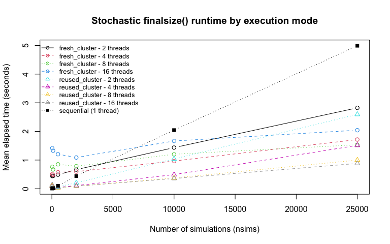
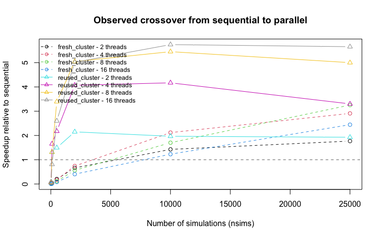

This vignette benchmarks the stochastic `finalsize()` workflow with:

1.  `nthreads = 1` for the sequential baseline,
2.  `finalsize()` creating a fresh cluster internally for each call, and
3.  pre-built clusters passed through the `cluster` argument.

The main goal is to identify the crossover point where parallel
execution becomes faster than sequential execution, and to see how much
cluster reuse changes that threshold.

The hybrid method is intentionally excluded here because
`finalsize(method = "hybrid")` still delegates to
`getFinalSizeDistEscape()` without the new parallel path.

## Hardware

This benchmark is design to run on a variety of machines.

The results shown here were generated on a 2019 Macbook Pro with 2.4 GHz
8-Core Intel Core i9 and 32gb 2400hz DDR4 RAM, running MacOS Sequia
15.7.2.

To generate benchmark results on your own machine, run the code in this
vignette and compare the crossover points to those reported here. The
exact crossover points will depend on the hardware and software
environment, but the general patterns should be similar.

Set the `maxiumum_threads` variable in the code below to adjust the
maximum thread count tested based on your machine’s capabilities.

    detected_threads <- parallel::detectCores()
    if (is.na(detected_threads)) {
      detected_threads <- 1L
    }

    maximum_threads <- 16L
    if (detected_threads < maximum_threads) {
      message("Detected ", detected_threads, " threads. Adjusting maximum_threads to ", detected_threads, ".")
      maximum_threads <- detected_threads
    }

    thread_options <- sort(unique(c(1L, 2L, 4L, 8L, maximum_threads)))
    message("Thread counts that will be included in the benchmark: ", paste(thread_options, collapse = ", "))
    #> Thread counts that will be included in the benchmark: 1, 2, 4, 8, 16

    library(multigroup.vaccine)
    library(knitr)

## Benchmark Scenario

The benchmark uses a two-group model that is still lightweight enough to
render as a vignette while exercising the stochastic simulation path.

    popsize <- c(600, 400)
    R0 <- 1.9
    contactmatrix <- contactMatrixPropPref(
      popsize = popsize,
      contactrate = c(1, 1.3),
      ingroup = c(0.35, 0.45)
    )
    relsusc <- c(1.0, 0.9)
    reltransm <- c(1.0, 1.1)
    initR <- c(0, 0)
    initI <- c(2, 1)
    initV <- c(90, 60)

    benchmark_args <- list(
      popsize = popsize,
      R0 = R0,
      contactmatrix = contactmatrix,
      relsusc = relsusc,
      reltransm = reltransm,
      initR = initR,
      initI = initI,
      initV = initV,
      method = "stochastic"
    )

## Benchmark Grid

This benchmark now checks thread counts up to `maximum_threads`,
assuming the machine exposes that many cores. The simulation counts are
chosen to help identify the point where parallel execution begins to win
after cluster overhead is amortized.

    benchmark_nsims <- c(25L, 100L, 500L, 2000L, 10000L, 25000L)
    benchmark_reps <- 2L

    if (detected_threads == 1L) {
      message("Only one thread detected. Parallel benchmarks will be skipped.")
    }

    thread_options <- thread_options[thread_options <= detected_threads]
    parallel_thread_options <- thread_options[thread_options > 1L]

    benchmark_grid <- expand.grid(
      nsims = benchmark_nsims,
      nthreads = thread_options
    )

    kable(benchmark_grid, caption = "Simulation counts and thread counts included in the benchmark.")

<table>
<caption>Simulation counts and thread counts included in the
benchmark.</caption>
<thead>
<tr>
<th style="text-align: right;">nsims</th>
<th style="text-align: right;">nthreads</th>
</tr>
</thead>
<tbody>
<tr>
<td style="text-align: right;">25</td>
<td style="text-align: right;">1</td>
</tr>
<tr>
<td style="text-align: right;">100</td>
<td style="text-align: right;">1</td>
</tr>
<tr>
<td style="text-align: right;">500</td>
<td style="text-align: right;">1</td>
</tr>
<tr>
<td style="text-align: right;">2000</td>
<td style="text-align: right;">1</td>
</tr>
<tr>
<td style="text-align: right;">10000</td>
<td style="text-align: right;">1</td>
</tr>
<tr>
<td style="text-align: right;">25000</td>
<td style="text-align: right;">1</td>
</tr>
<tr>
<td style="text-align: right;">25</td>
<td style="text-align: right;">2</td>
</tr>
<tr>
<td style="text-align: right;">100</td>
<td style="text-align: right;">2</td>
</tr>
<tr>
<td style="text-align: right;">500</td>
<td style="text-align: right;">2</td>
</tr>
<tr>
<td style="text-align: right;">2000</td>
<td style="text-align: right;">2</td>
</tr>
<tr>
<td style="text-align: right;">10000</td>
<td style="text-align: right;">2</td>
</tr>
<tr>
<td style="text-align: right;">25000</td>
<td style="text-align: right;">2</td>
</tr>
<tr>
<td style="text-align: right;">25</td>
<td style="text-align: right;">4</td>
</tr>
<tr>
<td style="text-align: right;">100</td>
<td style="text-align: right;">4</td>
</tr>
<tr>
<td style="text-align: right;">500</td>
<td style="text-align: right;">4</td>
</tr>
<tr>
<td style="text-align: right;">2000</td>
<td style="text-align: right;">4</td>
</tr>
<tr>
<td style="text-align: right;">10000</td>
<td style="text-align: right;">4</td>
</tr>
<tr>
<td style="text-align: right;">25000</td>
<td style="text-align: right;">4</td>
</tr>
<tr>
<td style="text-align: right;">25</td>
<td style="text-align: right;">8</td>
</tr>
<tr>
<td style="text-align: right;">100</td>
<td style="text-align: right;">8</td>
</tr>
<tr>
<td style="text-align: right;">500</td>
<td style="text-align: right;">8</td>
</tr>
<tr>
<td style="text-align: right;">2000</td>
<td style="text-align: right;">8</td>
</tr>
<tr>
<td style="text-align: right;">10000</td>
<td style="text-align: right;">8</td>
</tr>
<tr>
<td style="text-align: right;">25000</td>
<td style="text-align: right;">8</td>
</tr>
<tr>
<td style="text-align: right;">25</td>
<td style="text-align: right;">16</td>
</tr>
<tr>
<td style="text-align: right;">100</td>
<td style="text-align: right;">16</td>
</tr>
<tr>
<td style="text-align: right;">500</td>
<td style="text-align: right;">16</td>
</tr>
<tr>
<td style="text-align: right;">2000</td>
<td style="text-align: right;">16</td>
</tr>
<tr>
<td style="text-align: right;">10000</td>
<td style="text-align: right;">16</td>
</tr>
<tr>
<td style="text-align: right;">25000</td>
<td style="text-align: right;">16</td>
</tr>
</tbody>
</table>

## Reproducibility Check

Before comparing timings, verify that sequential, fresh-cluster
parallel, and reused-cluster parallel execution all return identical
stochastic draws under the same random seed.

    if (length(parallel_thread_options) > 0L) {
      comparison_threads <- parallel_thread_options[1]
      comparison_cluster <- parallel::makeCluster(comparison_threads)
      on.exit(parallel::stopCluster(comparison_cluster), add = TRUE)

      set.seed(20260311)
      sequential_result <- do.call(
        finalsize,
        c(benchmark_args, list(nsims = 50L, nthreads = 1L))
      )

      set.seed(20260311)
      fresh_cluster_result <- do.call(
        finalsize,
        c(benchmark_args, list(nsims = 50L, nthreads = comparison_threads))
      )

      set.seed(20260311)
      reused_cluster_result <- do.call(
        finalsize,
        c(benchmark_args, list(nsims = 50L, cluster = comparison_cluster))
      )

      reproducibility_check <- data.frame(
        nsims = 50L,
        comparison_threads = comparison_threads,
        fresh_matches_sequential = isTRUE(all.equal(sequential_result, fresh_cluster_result)),
        reused_matches_sequential = isTRUE(all.equal(sequential_result, reused_cluster_result))
      )
    } else {
      reproducibility_check <- data.frame(
        nsims = 50L,
        comparison_threads = NA_integer_,
        fresh_matches_sequential = NA,
        reused_matches_sequential = NA
      )
    }

    kable(reproducibility_check, caption = "Reproducibility check across execution modes.")

<table>
<caption>Reproducibility check across execution modes.</caption>
<colgroup>
<col style="width: 7%" />
<col style="width: 25%" />
<col style="width: 32%" />
<col style="width: 34%" />
</colgroup>
<thead>
<tr>
<th style="text-align: right;">nsims</th>
<th style="text-align: right;">comparison_threads</th>
<th style="text-align: left;">fresh_matches_sequential</th>
<th style="text-align: left;">reused_matches_sequential</th>
</tr>
</thead>
<tbody>
<tr>
<td style="text-align: right;">50</td>
<td style="text-align: right;">2</td>
<td style="text-align: left;">TRUE</td>
<td style="text-align: left;">TRUE</td>
</tr>
</tbody>
</table>

## Timing Helpers

The helper below measures elapsed time for three execution modes:

- `sequential`: `nthreads = 1`
- `fresh_cluster`: `finalsize()` creates and destroys a cluster
  internally
- `reused_cluster`: a pre-built cluster is reused across benchmark
  replicates

<!-- -->

    run_benchmark_case <- function(nsims, mode, nthreads = 1L, cluster = NULL, reps = 2L) {
      elapsed <- numeric(reps)

      for (rep in seq_len(reps)) {
        seed <- 5000L + rep
        elapsed[rep] <- unname(system.time({
          set.seed(seed)

          if (mode == "reused_cluster") {
            do.call(
              finalsize,
              c(benchmark_args, list(nsims = nsims, cluster = cluster))
            )
          } else {
            do.call(
              finalsize,
              c(benchmark_args, list(nsims = nsims, nthreads = nthreads))
            )
          }
        })["elapsed"])
      }

      data.frame(
        nsims = nsims,
        mode = mode,
        nthreads = nthreads,
        replicate = seq_len(reps),
        elapsed = elapsed
      )
    }

    run_full_benchmark <- function(nsims_values, parallel_threads, reps = 2L) {
      reusable_clusters <- vector("list", length(parallel_threads))
      names(reusable_clusters) <- as.character(parallel_threads)

      if (length(parallel_threads) > 0L) {
        for (i in seq_along(parallel_threads)) {
          reusable_clusters[[i]] <- parallel::makeCluster(parallel_threads[i])
        }

        on.exit(
          invisible(lapply(reusable_clusters, parallel::stopCluster)),
          add = TRUE
        )
      }

      results <- list()
      idx <- 1L

      for (nsims in nsims_values) {
        results[[idx]] <- run_benchmark_case(
          nsims = nsims,
          mode = "sequential",
          nthreads = 1L,
          reps = reps
        )
        idx <- idx + 1L

        for (thread_count in parallel_threads) {
          results[[idx]] <- run_benchmark_case(
            nsims = nsims,
            mode = "fresh_cluster",
            nthreads = thread_count,
            reps = reps
          )
          idx <- idx + 1L

          results[[idx]] <- run_benchmark_case(
            nsims = nsims,
            mode = "reused_cluster",
            nthreads = thread_count,
            cluster = reusable_clusters[[as.character(thread_count)]],
            reps = reps
          )
          idx <- idx + 1L
        }
      }

      do.call(rbind, results)
    }

    benchmark_results <- run_full_benchmark(
      nsims_values = benchmark_nsims,
      parallel_threads = parallel_thread_options,
      reps = benchmark_reps
    )

    kable(
      benchmark_results,
      digits = 3,
      caption = "Elapsed time (seconds) for each benchmark replicate."
    )

<table>
<caption>Elapsed time (seconds) for each benchmark replicate.</caption>
<thead>
<tr>
<th style="text-align: right;">nsims</th>
<th style="text-align: left;">mode</th>
<th style="text-align: right;">nthreads</th>
<th style="text-align: right;">replicate</th>
<th style="text-align: right;">elapsed</th>
</tr>
</thead>
<tbody>
<tr>
<td style="text-align: right;">25</td>
<td style="text-align: left;">sequential</td>
<td style="text-align: right;">1</td>
<td style="text-align: right;">1</td>
<td style="text-align: right;">0.008</td>
</tr>
<tr>
<td style="text-align: right;">25</td>
<td style="text-align: left;">sequential</td>
<td style="text-align: right;">1</td>
<td style="text-align: right;">2</td>
<td style="text-align: right;">0.005</td>
</tr>
<tr>
<td style="text-align: right;">25</td>
<td style="text-align: left;">fresh_cluster</td>
<td style="text-align: right;">2</td>
<td style="text-align: right;">1</td>
<td style="text-align: right;">0.444</td>
</tr>
<tr>
<td style="text-align: right;">25</td>
<td style="text-align: left;">fresh_cluster</td>
<td style="text-align: right;">2</td>
<td style="text-align: right;">2</td>
<td style="text-align: right;">0.439</td>
</tr>
<tr>
<td style="text-align: right;">25</td>
<td style="text-align: left;">reused_cluster</td>
<td style="text-align: right;">2</td>
<td style="text-align: right;">1</td>
<td style="text-align: right;">0.140</td>
</tr>
<tr>
<td style="text-align: right;">25</td>
<td style="text-align: left;">reused_cluster</td>
<td style="text-align: right;">2</td>
<td style="text-align: right;">2</td>
<td style="text-align: right;">0.007</td>
</tr>
<tr>
<td style="text-align: right;">25</td>
<td style="text-align: left;">fresh_cluster</td>
<td style="text-align: right;">4</td>
<td style="text-align: right;">1</td>
<td style="text-align: right;">0.529</td>
</tr>
<tr>
<td style="text-align: right;">25</td>
<td style="text-align: left;">fresh_cluster</td>
<td style="text-align: right;">4</td>
<td style="text-align: right;">2</td>
<td style="text-align: right;">0.488</td>
</tr>
<tr>
<td style="text-align: right;">25</td>
<td style="text-align: left;">reused_cluster</td>
<td style="text-align: right;">4</td>
<td style="text-align: right;">1</td>
<td style="text-align: right;">0.164</td>
</tr>
<tr>
<td style="text-align: right;">25</td>
<td style="text-align: left;">reused_cluster</td>
<td style="text-align: right;">4</td>
<td style="text-align: right;">2</td>
<td style="text-align: right;">0.008</td>
</tr>
<tr>
<td style="text-align: right;">25</td>
<td style="text-align: left;">fresh_cluster</td>
<td style="text-align: right;">8</td>
<td style="text-align: right;">1</td>
<td style="text-align: right;">0.814</td>
</tr>
<tr>
<td style="text-align: right;">25</td>
<td style="text-align: left;">fresh_cluster</td>
<td style="text-align: right;">8</td>
<td style="text-align: right;">2</td>
<td style="text-align: right;">0.712</td>
</tr>
<tr>
<td style="text-align: right;">25</td>
<td style="text-align: left;">reused_cluster</td>
<td style="text-align: right;">8</td>
<td style="text-align: right;">1</td>
<td style="text-align: right;">0.185</td>
</tr>
<tr>
<td style="text-align: right;">25</td>
<td style="text-align: left;">reused_cluster</td>
<td style="text-align: right;">8</td>
<td style="text-align: right;">2</td>
<td style="text-align: right;">0.011</td>
</tr>
<tr>
<td style="text-align: right;">25</td>
<td style="text-align: left;">fresh_cluster</td>
<td style="text-align: right;">16</td>
<td style="text-align: right;">1</td>
<td style="text-align: right;">1.659</td>
</tr>
<tr>
<td style="text-align: right;">25</td>
<td style="text-align: left;">fresh_cluster</td>
<td style="text-align: right;">16</td>
<td style="text-align: right;">2</td>
<td style="text-align: right;">1.174</td>
</tr>
<tr>
<td style="text-align: right;">25</td>
<td style="text-align: left;">reused_cluster</td>
<td style="text-align: right;">16</td>
<td style="text-align: right;">1</td>
<td style="text-align: right;">0.250</td>
</tr>
<tr>
<td style="text-align: right;">25</td>
<td style="text-align: left;">reused_cluster</td>
<td style="text-align: right;">16</td>
<td style="text-align: right;">2</td>
<td style="text-align: right;">0.016</td>
</tr>
<tr>
<td style="text-align: right;">100</td>
<td style="text-align: left;">sequential</td>
<td style="text-align: right;">1</td>
<td style="text-align: right;">1</td>
<td style="text-align: right;">0.019</td>
</tr>
<tr>
<td style="text-align: right;">100</td>
<td style="text-align: left;">sequential</td>
<td style="text-align: right;">1</td>
<td style="text-align: right;">2</td>
<td style="text-align: right;">0.019</td>
</tr>
<tr>
<td style="text-align: right;">100</td>
<td style="text-align: left;">fresh_cluster</td>
<td style="text-align: right;">2</td>
<td style="text-align: right;">1</td>
<td style="text-align: right;">0.447</td>
</tr>
<tr>
<td style="text-align: right;">100</td>
<td style="text-align: left;">fresh_cluster</td>
<td style="text-align: right;">2</td>
<td style="text-align: right;">2</td>
<td style="text-align: right;">0.446</td>
</tr>
<tr>
<td style="text-align: right;">100</td>
<td style="text-align: left;">reused_cluster</td>
<td style="text-align: right;">2</td>
<td style="text-align: right;">1</td>
<td style="text-align: right;">0.015</td>
</tr>
<tr>
<td style="text-align: right;">100</td>
<td style="text-align: left;">reused_cluster</td>
<td style="text-align: right;">2</td>
<td style="text-align: right;">2</td>
<td style="text-align: right;">0.014</td>
</tr>
<tr>
<td style="text-align: right;">100</td>
<td style="text-align: left;">fresh_cluster</td>
<td style="text-align: right;">4</td>
<td style="text-align: right;">1</td>
<td style="text-align: right;">0.469</td>
</tr>
<tr>
<td style="text-align: right;">100</td>
<td style="text-align: left;">fresh_cluster</td>
<td style="text-align: right;">4</td>
<td style="text-align: right;">2</td>
<td style="text-align: right;">0.489</td>
</tr>
<tr>
<td style="text-align: right;">100</td>
<td style="text-align: left;">reused_cluster</td>
<td style="text-align: right;">4</td>
<td style="text-align: right;">1</td>
<td style="text-align: right;">0.012</td>
</tr>
<tr>
<td style="text-align: right;">100</td>
<td style="text-align: left;">reused_cluster</td>
<td style="text-align: right;">4</td>
<td style="text-align: right;">2</td>
<td style="text-align: right;">0.011</td>
</tr>
<tr>
<td style="text-align: right;">100</td>
<td style="text-align: left;">fresh_cluster</td>
<td style="text-align: right;">8</td>
<td style="text-align: right;">1</td>
<td style="text-align: right;">0.612</td>
</tr>
<tr>
<td style="text-align: right;">100</td>
<td style="text-align: left;">fresh_cluster</td>
<td style="text-align: right;">8</td>
<td style="text-align: right;">2</td>
<td style="text-align: right;">0.730</td>
</tr>
<tr>
<td style="text-align: right;">100</td>
<td style="text-align: left;">reused_cluster</td>
<td style="text-align: right;">8</td>
<td style="text-align: right;">1</td>
<td style="text-align: right;">0.014</td>
</tr>
<tr>
<td style="text-align: right;">100</td>
<td style="text-align: left;">reused_cluster</td>
<td style="text-align: right;">8</td>
<td style="text-align: right;">2</td>
<td style="text-align: right;">0.015</td>
</tr>
<tr>
<td style="text-align: right;">100</td>
<td style="text-align: left;">fresh_cluster</td>
<td style="text-align: right;">16</td>
<td style="text-align: right;">1</td>
<td style="text-align: right;">1.420</td>
</tr>
<tr>
<td style="text-align: right;">100</td>
<td style="text-align: left;">fresh_cluster</td>
<td style="text-align: right;">16</td>
<td style="text-align: right;">2</td>
<td style="text-align: right;">1.226</td>
</tr>
<tr>
<td style="text-align: right;">100</td>
<td style="text-align: left;">reused_cluster</td>
<td style="text-align: right;">16</td>
<td style="text-align: right;">1</td>
<td style="text-align: right;">0.024</td>
</tr>
<tr>
<td style="text-align: right;">100</td>
<td style="text-align: left;">reused_cluster</td>
<td style="text-align: right;">16</td>
<td style="text-align: right;">2</td>
<td style="text-align: right;">0.023</td>
</tr>
<tr>
<td style="text-align: right;">500</td>
<td style="text-align: left;">sequential</td>
<td style="text-align: right;">1</td>
<td style="text-align: right;">1</td>
<td style="text-align: right;">0.101</td>
</tr>
<tr>
<td style="text-align: right;">500</td>
<td style="text-align: left;">sequential</td>
<td style="text-align: right;">1</td>
<td style="text-align: right;">2</td>
<td style="text-align: right;">0.099</td>
</tr>
<tr>
<td style="text-align: right;">500</td>
<td style="text-align: left;">fresh_cluster</td>
<td style="text-align: right;">2</td>
<td style="text-align: right;">1</td>
<td style="text-align: right;">0.488</td>
</tr>
<tr>
<td style="text-align: right;">500</td>
<td style="text-align: left;">fresh_cluster</td>
<td style="text-align: right;">2</td>
<td style="text-align: right;">2</td>
<td style="text-align: right;">0.489</td>
</tr>
<tr>
<td style="text-align: right;">500</td>
<td style="text-align: left;">reused_cluster</td>
<td style="text-align: right;">2</td>
<td style="text-align: right;">1</td>
<td style="text-align: right;">0.062</td>
</tr>
<tr>
<td style="text-align: right;">500</td>
<td style="text-align: left;">reused_cluster</td>
<td style="text-align: right;">2</td>
<td style="text-align: right;">2</td>
<td style="text-align: right;">0.072</td>
</tr>
<tr>
<td style="text-align: right;">500</td>
<td style="text-align: left;">fresh_cluster</td>
<td style="text-align: right;">4</td>
<td style="text-align: right;">1</td>
<td style="text-align: right;">0.564</td>
</tr>
<tr>
<td style="text-align: right;">500</td>
<td style="text-align: left;">fresh_cluster</td>
<td style="text-align: right;">4</td>
<td style="text-align: right;">2</td>
<td style="text-align: right;">0.587</td>
</tr>
<tr>
<td style="text-align: right;">500</td>
<td style="text-align: left;">reused_cluster</td>
<td style="text-align: right;">4</td>
<td style="text-align: right;">1</td>
<td style="text-align: right;">0.036</td>
</tr>
<tr>
<td style="text-align: right;">500</td>
<td style="text-align: left;">reused_cluster</td>
<td style="text-align: right;">4</td>
<td style="text-align: right;">2</td>
<td style="text-align: right;">0.056</td>
</tr>
<tr>
<td style="text-align: right;">500</td>
<td style="text-align: left;">fresh_cluster</td>
<td style="text-align: right;">8</td>
<td style="text-align: right;">1</td>
<td style="text-align: right;">0.851</td>
</tr>
<tr>
<td style="text-align: right;">500</td>
<td style="text-align: left;">fresh_cluster</td>
<td style="text-align: right;">8</td>
<td style="text-align: right;">2</td>
<td style="text-align: right;">0.854</td>
</tr>
<tr>
<td style="text-align: right;">500</td>
<td style="text-align: left;">reused_cluster</td>
<td style="text-align: right;">8</td>
<td style="text-align: right;">1</td>
<td style="text-align: right;">0.028</td>
</tr>
<tr>
<td style="text-align: right;">500</td>
<td style="text-align: left;">reused_cluster</td>
<td style="text-align: right;">8</td>
<td style="text-align: right;">2</td>
<td style="text-align: right;">0.031</td>
</tr>
<tr>
<td style="text-align: right;">500</td>
<td style="text-align: left;">fresh_cluster</td>
<td style="text-align: right;">16</td>
<td style="text-align: right;">1</td>
<td style="text-align: right;">1.229</td>
</tr>
<tr>
<td style="text-align: right;">500</td>
<td style="text-align: left;">fresh_cluster</td>
<td style="text-align: right;">16</td>
<td style="text-align: right;">2</td>
<td style="text-align: right;">1.182</td>
</tr>
<tr>
<td style="text-align: right;">500</td>
<td style="text-align: left;">reused_cluster</td>
<td style="text-align: right;">16</td>
<td style="text-align: right;">1</td>
<td style="text-align: right;">0.041</td>
</tr>
<tr>
<td style="text-align: right;">500</td>
<td style="text-align: left;">reused_cluster</td>
<td style="text-align: right;">16</td>
<td style="text-align: right;">2</td>
<td style="text-align: right;">0.036</td>
</tr>
<tr>
<td style="text-align: right;">2000</td>
<td style="text-align: left;">sequential</td>
<td style="text-align: right;">1</td>
<td style="text-align: right;">1</td>
<td style="text-align: right;">0.458</td>
</tr>
<tr>
<td style="text-align: right;">2000</td>
<td style="text-align: left;">sequential</td>
<td style="text-align: right;">1</td>
<td style="text-align: right;">2</td>
<td style="text-align: right;">0.425</td>
</tr>
<tr>
<td style="text-align: right;">2000</td>
<td style="text-align: left;">fresh_cluster</td>
<td style="text-align: right;">2</td>
<td style="text-align: right;">1</td>
<td style="text-align: right;">0.667</td>
</tr>
<tr>
<td style="text-align: right;">2000</td>
<td style="text-align: left;">fresh_cluster</td>
<td style="text-align: right;">2</td>
<td style="text-align: right;">2</td>
<td style="text-align: right;">0.665</td>
</tr>
<tr>
<td style="text-align: right;">2000</td>
<td style="text-align: left;">reused_cluster</td>
<td style="text-align: right;">2</td>
<td style="text-align: right;">1</td>
<td style="text-align: right;">0.203</td>
</tr>
<tr>
<td style="text-align: right;">2000</td>
<td style="text-align: left;">reused_cluster</td>
<td style="text-align: right;">2</td>
<td style="text-align: right;">2</td>
<td style="text-align: right;">0.208</td>
</tr>
<tr>
<td style="text-align: right;">2000</td>
<td style="text-align: left;">fresh_cluster</td>
<td style="text-align: right;">4</td>
<td style="text-align: right;">1</td>
<td style="text-align: right;">0.593</td>
</tr>
<tr>
<td style="text-align: right;">2000</td>
<td style="text-align: left;">fresh_cluster</td>
<td style="text-align: right;">4</td>
<td style="text-align: right;">2</td>
<td style="text-align: right;">0.600</td>
</tr>
<tr>
<td style="text-align: right;">2000</td>
<td style="text-align: left;">reused_cluster</td>
<td style="text-align: right;">4</td>
<td style="text-align: right;">1</td>
<td style="text-align: right;">0.107</td>
</tr>
<tr>
<td style="text-align: right;">2000</td>
<td style="text-align: left;">reused_cluster</td>
<td style="text-align: right;">4</td>
<td style="text-align: right;">2</td>
<td style="text-align: right;">0.110</td>
</tr>
<tr>
<td style="text-align: right;">2000</td>
<td style="text-align: left;">fresh_cluster</td>
<td style="text-align: right;">8</td>
<td style="text-align: right;">1</td>
<td style="text-align: right;">0.749</td>
</tr>
<tr>
<td style="text-align: right;">2000</td>
<td style="text-align: left;">fresh_cluster</td>
<td style="text-align: right;">8</td>
<td style="text-align: right;">2</td>
<td style="text-align: right;">0.821</td>
</tr>
<tr>
<td style="text-align: right;">2000</td>
<td style="text-align: left;">reused_cluster</td>
<td style="text-align: right;">8</td>
<td style="text-align: right;">1</td>
<td style="text-align: right;">0.084</td>
</tr>
<tr>
<td style="text-align: right;">2000</td>
<td style="text-align: left;">reused_cluster</td>
<td style="text-align: right;">8</td>
<td style="text-align: right;">2</td>
<td style="text-align: right;">0.091</td>
</tr>
<tr>
<td style="text-align: right;">2000</td>
<td style="text-align: left;">fresh_cluster</td>
<td style="text-align: right;">16</td>
<td style="text-align: right;">1</td>
<td style="text-align: right;">1.099</td>
</tr>
<tr>
<td style="text-align: right;">2000</td>
<td style="text-align: left;">fresh_cluster</td>
<td style="text-align: right;">16</td>
<td style="text-align: right;">2</td>
<td style="text-align: right;">1.079</td>
</tr>
<tr>
<td style="text-align: right;">2000</td>
<td style="text-align: left;">reused_cluster</td>
<td style="text-align: right;">16</td>
<td style="text-align: right;">1</td>
<td style="text-align: right;">0.089</td>
</tr>
<tr>
<td style="text-align: right;">2000</td>
<td style="text-align: left;">reused_cluster</td>
<td style="text-align: right;">16</td>
<td style="text-align: right;">2</td>
<td style="text-align: right;">0.087</td>
</tr>
<tr>
<td style="text-align: right;">10000</td>
<td style="text-align: left;">sequential</td>
<td style="text-align: right;">1</td>
<td style="text-align: right;">1</td>
<td style="text-align: right;">2.038</td>
</tr>
<tr>
<td style="text-align: right;">10000</td>
<td style="text-align: left;">sequential</td>
<td style="text-align: right;">1</td>
<td style="text-align: right;">2</td>
<td style="text-align: right;">2.052</td>
</tr>
<tr>
<td style="text-align: right;">10000</td>
<td style="text-align: left;">fresh_cluster</td>
<td style="text-align: right;">2</td>
<td style="text-align: right;">1</td>
<td style="text-align: right;">1.378</td>
</tr>
<tr>
<td style="text-align: right;">10000</td>
<td style="text-align: left;">fresh_cluster</td>
<td style="text-align: right;">2</td>
<td style="text-align: right;">2</td>
<td style="text-align: right;">1.490</td>
</tr>
<tr>
<td style="text-align: right;">10000</td>
<td style="text-align: left;">reused_cluster</td>
<td style="text-align: right;">2</td>
<td style="text-align: right;">1</td>
<td style="text-align: right;">1.071</td>
</tr>
<tr>
<td style="text-align: right;">10000</td>
<td style="text-align: left;">reused_cluster</td>
<td style="text-align: right;">2</td>
<td style="text-align: right;">2</td>
<td style="text-align: right;">1.009</td>
</tr>
<tr>
<td style="text-align: right;">10000</td>
<td style="text-align: left;">fresh_cluster</td>
<td style="text-align: right;">4</td>
<td style="text-align: right;">1</td>
<td style="text-align: right;">0.970</td>
</tr>
<tr>
<td style="text-align: right;">10000</td>
<td style="text-align: left;">fresh_cluster</td>
<td style="text-align: right;">4</td>
<td style="text-align: right;">2</td>
<td style="text-align: right;">0.961</td>
</tr>
<tr>
<td style="text-align: right;">10000</td>
<td style="text-align: left;">reused_cluster</td>
<td style="text-align: right;">4</td>
<td style="text-align: right;">1</td>
<td style="text-align: right;">0.492</td>
</tr>
<tr>
<td style="text-align: right;">10000</td>
<td style="text-align: left;">reused_cluster</td>
<td style="text-align: right;">4</td>
<td style="text-align: right;">2</td>
<td style="text-align: right;">0.489</td>
</tr>
<tr>
<td style="text-align: right;">10000</td>
<td style="text-align: left;">fresh_cluster</td>
<td style="text-align: right;">8</td>
<td style="text-align: right;">1</td>
<td style="text-align: right;">1.219</td>
</tr>
<tr>
<td style="text-align: right;">10000</td>
<td style="text-align: left;">fresh_cluster</td>
<td style="text-align: right;">8</td>
<td style="text-align: right;">2</td>
<td style="text-align: right;">1.186</td>
</tr>
<tr>
<td style="text-align: right;">10000</td>
<td style="text-align: left;">reused_cluster</td>
<td style="text-align: right;">8</td>
<td style="text-align: right;">1</td>
<td style="text-align: right;">0.379</td>
</tr>
<tr>
<td style="text-align: right;">10000</td>
<td style="text-align: left;">reused_cluster</td>
<td style="text-align: right;">8</td>
<td style="text-align: right;">2</td>
<td style="text-align: right;">0.371</td>
</tr>
<tr>
<td style="text-align: right;">10000</td>
<td style="text-align: left;">fresh_cluster</td>
<td style="text-align: right;">16</td>
<td style="text-align: right;">1</td>
<td style="text-align: right;">1.435</td>
</tr>
<tr>
<td style="text-align: right;">10000</td>
<td style="text-align: left;">fresh_cluster</td>
<td style="text-align: right;">16</td>
<td style="text-align: right;">2</td>
<td style="text-align: right;">1.896</td>
</tr>
<tr>
<td style="text-align: right;">10000</td>
<td style="text-align: left;">reused_cluster</td>
<td style="text-align: right;">16</td>
<td style="text-align: right;">1</td>
<td style="text-align: right;">0.356</td>
</tr>
<tr>
<td style="text-align: right;">10000</td>
<td style="text-align: left;">reused_cluster</td>
<td style="text-align: right;">16</td>
<td style="text-align: right;">2</td>
<td style="text-align: right;">0.356</td>
</tr>
<tr>
<td style="text-align: right;">25000</td>
<td style="text-align: left;">sequential</td>
<td style="text-align: right;">1</td>
<td style="text-align: right;">1</td>
<td style="text-align: right;">5.224</td>
</tr>
<tr>
<td style="text-align: right;">25000</td>
<td style="text-align: left;">sequential</td>
<td style="text-align: right;">1</td>
<td style="text-align: right;">2</td>
<td style="text-align: right;">4.759</td>
</tr>
<tr>
<td style="text-align: right;">25000</td>
<td style="text-align: left;">fresh_cluster</td>
<td style="text-align: right;">2</td>
<td style="text-align: right;">1</td>
<td style="text-align: right;">2.671</td>
</tr>
<tr>
<td style="text-align: right;">25000</td>
<td style="text-align: left;">fresh_cluster</td>
<td style="text-align: right;">2</td>
<td style="text-align: right;">2</td>
<td style="text-align: right;">2.975</td>
</tr>
<tr>
<td style="text-align: right;">25000</td>
<td style="text-align: left;">reused_cluster</td>
<td style="text-align: right;">2</td>
<td style="text-align: right;">1</td>
<td style="text-align: right;">2.601</td>
</tr>
<tr>
<td style="text-align: right;">25000</td>
<td style="text-align: left;">reused_cluster</td>
<td style="text-align: right;">2</td>
<td style="text-align: right;">2</td>
<td style="text-align: right;">2.586</td>
</tr>
<tr>
<td style="text-align: right;">25000</td>
<td style="text-align: left;">fresh_cluster</td>
<td style="text-align: right;">4</td>
<td style="text-align: right;">1</td>
<td style="text-align: right;">1.776</td>
</tr>
<tr>
<td style="text-align: right;">25000</td>
<td style="text-align: left;">fresh_cluster</td>
<td style="text-align: right;">4</td>
<td style="text-align: right;">2</td>
<td style="text-align: right;">1.656</td>
</tr>
<tr>
<td style="text-align: right;">25000</td>
<td style="text-align: left;">reused_cluster</td>
<td style="text-align: right;">4</td>
<td style="text-align: right;">1</td>
<td style="text-align: right;">1.295</td>
</tr>
<tr>
<td style="text-align: right;">25000</td>
<td style="text-align: left;">reused_cluster</td>
<td style="text-align: right;">4</td>
<td style="text-align: right;">2</td>
<td style="text-align: right;">1.730</td>
</tr>
<tr>
<td style="text-align: right;">25000</td>
<td style="text-align: left;">fresh_cluster</td>
<td style="text-align: right;">8</td>
<td style="text-align: right;">1</td>
<td style="text-align: right;">1.598</td>
</tr>
<tr>
<td style="text-align: right;">25000</td>
<td style="text-align: left;">fresh_cluster</td>
<td style="text-align: right;">8</td>
<td style="text-align: right;">2</td>
<td style="text-align: right;">1.470</td>
</tr>
<tr>
<td style="text-align: right;">25000</td>
<td style="text-align: left;">reused_cluster</td>
<td style="text-align: right;">8</td>
<td style="text-align: right;">1</td>
<td style="text-align: right;">1.002</td>
</tr>
<tr>
<td style="text-align: right;">25000</td>
<td style="text-align: left;">reused_cluster</td>
<td style="text-align: right;">8</td>
<td style="text-align: right;">2</td>
<td style="text-align: right;">0.995</td>
</tr>
<tr>
<td style="text-align: right;">25000</td>
<td style="text-align: left;">fresh_cluster</td>
<td style="text-align: right;">16</td>
<td style="text-align: right;">1</td>
<td style="text-align: right;">2.153</td>
</tr>
<tr>
<td style="text-align: right;">25000</td>
<td style="text-align: left;">fresh_cluster</td>
<td style="text-align: right;">16</td>
<td style="text-align: right;">2</td>
<td style="text-align: right;">1.932</td>
</tr>
<tr>
<td style="text-align: right;">25000</td>
<td style="text-align: left;">reused_cluster</td>
<td style="text-align: right;">16</td>
<td style="text-align: right;">1</td>
<td style="text-align: right;">0.859</td>
</tr>
<tr>
<td style="text-align: right;">25000</td>
<td style="text-align: left;">reused_cluster</td>
<td style="text-align: right;">16</td>
<td style="text-align: right;">2</td>
<td style="text-align: right;">0.906</td>
</tr>
</tbody>
</table>

## Timing Summary

    mean_elapsed <- aggregate(
      elapsed ~ nsims + mode + nthreads,
      data = benchmark_results,
      FUN = mean
    )
    min_elapsed <- aggregate(
      elapsed ~ nsims + mode + nthreads,
      data = benchmark_results,
      FUN = min
    )
    max_elapsed <- aggregate(
      elapsed ~ nsims + mode + nthreads,
      data = benchmark_results,
      FUN = max
    )

    benchmark_summary <- merge(mean_elapsed, min_elapsed, by = c("nsims", "mode", "nthreads"))
    benchmark_summary <- merge(benchmark_summary, max_elapsed, by = c("nsims", "mode", "nthreads"))
    names(benchmark_summary) <- c("nsims", "mode", "nthreads", "mean_elapsed", "min_elapsed", "max_elapsed")

    baseline <- benchmark_summary[
      benchmark_summary$mode == "sequential",
      c("nsims", "mean_elapsed")
    ]
    names(baseline)[2] <- "sequential_mean_elapsed"

    benchmark_summary <- merge(benchmark_summary, baseline, by = "nsims")
    benchmark_summary$speedup_vs_sequential <- benchmark_summary$sequential_mean_elapsed / benchmark_summary$mean_elapsed
    benchmark_summary$relative_runtime_pct <- 100 * benchmark_summary$mean_elapsed / benchmark_summary$sequential_mean_elapsed
    benchmark_summary <- benchmark_summary[order(benchmark_summary$nsims, benchmark_summary$mode, benchmark_summary$nthreads), ]

    kable(
      benchmark_summary,
      digits = 3,
      caption = "Average timing summary and speedup relative to the sequential baseline."
    )

<table>
<caption>Average timing summary and speedup relative to the sequential
baseline.</caption>
<colgroup>
<col style="width: 2%" />
<col style="width: 4%" />
<col style="width: 10%" />
<col style="width: 6%" />
<col style="width: 9%" />
<col style="width: 8%" />
<col style="width: 8%" />
<col style="width: 17%" />
<col style="width: 16%" />
<col style="width: 15%" />
</colgroup>
<thead>
<tr>
<th style="text-align: left;"></th>
<th style="text-align: right;">nsims</th>
<th style="text-align: left;">mode</th>
<th style="text-align: right;">nthreads</th>
<th style="text-align: right;">mean_elapsed</th>
<th style="text-align: right;">min_elapsed</th>
<th style="text-align: right;">max_elapsed</th>
<th style="text-align: right;">sequential_mean_elapsed</th>
<th style="text-align: right;">speedup_vs_sequential</th>
<th style="text-align: right;">relative_runtime_pct</th>
</tr>
</thead>
<tbody>
<tr>
<td style="text-align: left;">2</td>
<td style="text-align: right;">25</td>
<td style="text-align: left;">fresh_cluster</td>
<td style="text-align: right;">2</td>
<td style="text-align: right;">0.442</td>
<td style="text-align: right;">0.439</td>
<td style="text-align: right;">0.444</td>
<td style="text-align: right;">0.006</td>
<td style="text-align: right;">0.015</td>
<td style="text-align: right;">6792.308</td>
</tr>
<tr>
<td style="text-align: left;">3</td>
<td style="text-align: right;">25</td>
<td style="text-align: left;">fresh_cluster</td>
<td style="text-align: right;">4</td>
<td style="text-align: right;">0.508</td>
<td style="text-align: right;">0.488</td>
<td style="text-align: right;">0.529</td>
<td style="text-align: right;">0.006</td>
<td style="text-align: right;">0.013</td>
<td style="text-align: right;">7823.077</td>
</tr>
<tr>
<td style="text-align: left;">4</td>
<td style="text-align: right;">25</td>
<td style="text-align: left;">fresh_cluster</td>
<td style="text-align: right;">8</td>
<td style="text-align: right;">0.763</td>
<td style="text-align: right;">0.712</td>
<td style="text-align: right;">0.814</td>
<td style="text-align: right;">0.006</td>
<td style="text-align: right;">0.009</td>
<td style="text-align: right;">11738.462</td>
</tr>
<tr>
<td style="text-align: left;">1</td>
<td style="text-align: right;">25</td>
<td style="text-align: left;">fresh_cluster</td>
<td style="text-align: right;">16</td>
<td style="text-align: right;">1.416</td>
<td style="text-align: right;">1.174</td>
<td style="text-align: right;">1.659</td>
<td style="text-align: right;">0.006</td>
<td style="text-align: right;">0.005</td>
<td style="text-align: right;">21792.308</td>
</tr>
<tr>
<td style="text-align: left;">6</td>
<td style="text-align: right;">25</td>
<td style="text-align: left;">reused_cluster</td>
<td style="text-align: right;">2</td>
<td style="text-align: right;">0.073</td>
<td style="text-align: right;">0.007</td>
<td style="text-align: right;">0.140</td>
<td style="text-align: right;">0.006</td>
<td style="text-align: right;">0.088</td>
<td style="text-align: right;">1130.769</td>
</tr>
<tr>
<td style="text-align: left;">7</td>
<td style="text-align: right;">25</td>
<td style="text-align: left;">reused_cluster</td>
<td style="text-align: right;">4</td>
<td style="text-align: right;">0.086</td>
<td style="text-align: right;">0.008</td>
<td style="text-align: right;">0.164</td>
<td style="text-align: right;">0.006</td>
<td style="text-align: right;">0.076</td>
<td style="text-align: right;">1323.077</td>
</tr>
<tr>
<td style="text-align: left;">8</td>
<td style="text-align: right;">25</td>
<td style="text-align: left;">reused_cluster</td>
<td style="text-align: right;">8</td>
<td style="text-align: right;">0.098</td>
<td style="text-align: right;">0.011</td>
<td style="text-align: right;">0.185</td>
<td style="text-align: right;">0.006</td>
<td style="text-align: right;">0.066</td>
<td style="text-align: right;">1507.692</td>
</tr>
<tr>
<td style="text-align: left;">5</td>
<td style="text-align: right;">25</td>
<td style="text-align: left;">reused_cluster</td>
<td style="text-align: right;">16</td>
<td style="text-align: right;">0.133</td>
<td style="text-align: right;">0.016</td>
<td style="text-align: right;">0.250</td>
<td style="text-align: right;">0.006</td>
<td style="text-align: right;">0.049</td>
<td style="text-align: right;">2046.154</td>
</tr>
<tr>
<td style="text-align: left;">9</td>
<td style="text-align: right;">25</td>
<td style="text-align: left;">sequential</td>
<td style="text-align: right;">1</td>
<td style="text-align: right;">0.006</td>
<td style="text-align: right;">0.005</td>
<td style="text-align: right;">0.008</td>
<td style="text-align: right;">0.006</td>
<td style="text-align: right;">1.000</td>
<td style="text-align: right;">100.000</td>
</tr>
<tr>
<td style="text-align: left;">11</td>
<td style="text-align: right;">100</td>
<td style="text-align: left;">fresh_cluster</td>
<td style="text-align: right;">2</td>
<td style="text-align: right;">0.447</td>
<td style="text-align: right;">0.446</td>
<td style="text-align: right;">0.447</td>
<td style="text-align: right;">0.019</td>
<td style="text-align: right;">0.043</td>
<td style="text-align: right;">2350.000</td>
</tr>
<tr>
<td style="text-align: left;">12</td>
<td style="text-align: right;">100</td>
<td style="text-align: left;">fresh_cluster</td>
<td style="text-align: right;">4</td>
<td style="text-align: right;">0.479</td>
<td style="text-align: right;">0.469</td>
<td style="text-align: right;">0.489</td>
<td style="text-align: right;">0.019</td>
<td style="text-align: right;">0.040</td>
<td style="text-align: right;">2521.053</td>
</tr>
<tr>
<td style="text-align: left;">13</td>
<td style="text-align: right;">100</td>
<td style="text-align: left;">fresh_cluster</td>
<td style="text-align: right;">8</td>
<td style="text-align: right;">0.671</td>
<td style="text-align: right;">0.612</td>
<td style="text-align: right;">0.730</td>
<td style="text-align: right;">0.019</td>
<td style="text-align: right;">0.028</td>
<td style="text-align: right;">3531.579</td>
</tr>
<tr>
<td style="text-align: left;">10</td>
<td style="text-align: right;">100</td>
<td style="text-align: left;">fresh_cluster</td>
<td style="text-align: right;">16</td>
<td style="text-align: right;">1.323</td>
<td style="text-align: right;">1.226</td>
<td style="text-align: right;">1.420</td>
<td style="text-align: right;">0.019</td>
<td style="text-align: right;">0.014</td>
<td style="text-align: right;">6963.158</td>
</tr>
<tr>
<td style="text-align: left;">15</td>
<td style="text-align: right;">100</td>
<td style="text-align: left;">reused_cluster</td>
<td style="text-align: right;">2</td>
<td style="text-align: right;">0.014</td>
<td style="text-align: right;">0.014</td>
<td style="text-align: right;">0.015</td>
<td style="text-align: right;">0.019</td>
<td style="text-align: right;">1.310</td>
<td style="text-align: right;">76.316</td>
</tr>
<tr>
<td style="text-align: left;">16</td>
<td style="text-align: right;">100</td>
<td style="text-align: left;">reused_cluster</td>
<td style="text-align: right;">4</td>
<td style="text-align: right;">0.011</td>
<td style="text-align: right;">0.011</td>
<td style="text-align: right;">0.012</td>
<td style="text-align: right;">0.019</td>
<td style="text-align: right;">1.652</td>
<td style="text-align: right;">60.526</td>
</tr>
<tr>
<td style="text-align: left;">17</td>
<td style="text-align: right;">100</td>
<td style="text-align: left;">reused_cluster</td>
<td style="text-align: right;">8</td>
<td style="text-align: right;">0.014</td>
<td style="text-align: right;">0.014</td>
<td style="text-align: right;">0.015</td>
<td style="text-align: right;">0.019</td>
<td style="text-align: right;">1.310</td>
<td style="text-align: right;">76.316</td>
</tr>
<tr>
<td style="text-align: left;">14</td>
<td style="text-align: right;">100</td>
<td style="text-align: left;">reused_cluster</td>
<td style="text-align: right;">16</td>
<td style="text-align: right;">0.023</td>
<td style="text-align: right;">0.023</td>
<td style="text-align: right;">0.024</td>
<td style="text-align: right;">0.019</td>
<td style="text-align: right;">0.809</td>
<td style="text-align: right;">123.684</td>
</tr>
<tr>
<td style="text-align: left;">18</td>
<td style="text-align: right;">100</td>
<td style="text-align: left;">sequential</td>
<td style="text-align: right;">1</td>
<td style="text-align: right;">0.019</td>
<td style="text-align: right;">0.019</td>
<td style="text-align: right;">0.019</td>
<td style="text-align: right;">0.019</td>
<td style="text-align: right;">1.000</td>
<td style="text-align: right;">100.000</td>
</tr>
<tr>
<td style="text-align: left;">20</td>
<td style="text-align: right;">500</td>
<td style="text-align: left;">fresh_cluster</td>
<td style="text-align: right;">2</td>
<td style="text-align: right;">0.489</td>
<td style="text-align: right;">0.488</td>
<td style="text-align: right;">0.489</td>
<td style="text-align: right;">0.100</td>
<td style="text-align: right;">0.205</td>
<td style="text-align: right;">488.500</td>
</tr>
<tr>
<td style="text-align: left;">21</td>
<td style="text-align: right;">500</td>
<td style="text-align: left;">fresh_cluster</td>
<td style="text-align: right;">4</td>
<td style="text-align: right;">0.575</td>
<td style="text-align: right;">0.564</td>
<td style="text-align: right;">0.587</td>
<td style="text-align: right;">0.100</td>
<td style="text-align: right;">0.174</td>
<td style="text-align: right;">575.500</td>
</tr>
<tr>
<td style="text-align: left;">22</td>
<td style="text-align: right;">500</td>
<td style="text-align: left;">fresh_cluster</td>
<td style="text-align: right;">8</td>
<td style="text-align: right;">0.852</td>
<td style="text-align: right;">0.851</td>
<td style="text-align: right;">0.854</td>
<td style="text-align: right;">0.100</td>
<td style="text-align: right;">0.117</td>
<td style="text-align: right;">852.500</td>
</tr>
<tr>
<td style="text-align: left;">19</td>
<td style="text-align: right;">500</td>
<td style="text-align: left;">fresh_cluster</td>
<td style="text-align: right;">16</td>
<td style="text-align: right;">1.206</td>
<td style="text-align: right;">1.182</td>
<td style="text-align: right;">1.229</td>
<td style="text-align: right;">0.100</td>
<td style="text-align: right;">0.083</td>
<td style="text-align: right;">1205.500</td>
</tr>
<tr>
<td style="text-align: left;">24</td>
<td style="text-align: right;">500</td>
<td style="text-align: left;">reused_cluster</td>
<td style="text-align: right;">2</td>
<td style="text-align: right;">0.067</td>
<td style="text-align: right;">0.062</td>
<td style="text-align: right;">0.072</td>
<td style="text-align: right;">0.100</td>
<td style="text-align: right;">1.493</td>
<td style="text-align: right;">67.000</td>
</tr>
<tr>
<td style="text-align: left;">25</td>
<td style="text-align: right;">500</td>
<td style="text-align: left;">reused_cluster</td>
<td style="text-align: right;">4</td>
<td style="text-align: right;">0.046</td>
<td style="text-align: right;">0.036</td>
<td style="text-align: right;">0.056</td>
<td style="text-align: right;">0.100</td>
<td style="text-align: right;">2.174</td>
<td style="text-align: right;">46.000</td>
</tr>
<tr>
<td style="text-align: left;">26</td>
<td style="text-align: right;">500</td>
<td style="text-align: left;">reused_cluster</td>
<td style="text-align: right;">8</td>
<td style="text-align: right;">0.030</td>
<td style="text-align: right;">0.028</td>
<td style="text-align: right;">0.031</td>
<td style="text-align: right;">0.100</td>
<td style="text-align: right;">3.390</td>
<td style="text-align: right;">29.500</td>
</tr>
<tr>
<td style="text-align: left;">23</td>
<td style="text-align: right;">500</td>
<td style="text-align: left;">reused_cluster</td>
<td style="text-align: right;">16</td>
<td style="text-align: right;">0.038</td>
<td style="text-align: right;">0.036</td>
<td style="text-align: right;">0.041</td>
<td style="text-align: right;">0.100</td>
<td style="text-align: right;">2.597</td>
<td style="text-align: right;">38.500</td>
</tr>
<tr>
<td style="text-align: left;">27</td>
<td style="text-align: right;">500</td>
<td style="text-align: left;">sequential</td>
<td style="text-align: right;">1</td>
<td style="text-align: right;">0.100</td>
<td style="text-align: right;">0.099</td>
<td style="text-align: right;">0.101</td>
<td style="text-align: right;">0.100</td>
<td style="text-align: right;">1.000</td>
<td style="text-align: right;">100.000</td>
</tr>
<tr>
<td style="text-align: left;">29</td>
<td style="text-align: right;">2000</td>
<td style="text-align: left;">fresh_cluster</td>
<td style="text-align: right;">2</td>
<td style="text-align: right;">0.666</td>
<td style="text-align: right;">0.665</td>
<td style="text-align: right;">0.667</td>
<td style="text-align: right;">0.441</td>
<td style="text-align: right;">0.663</td>
<td style="text-align: right;">150.849</td>
</tr>
<tr>
<td style="text-align: left;">30</td>
<td style="text-align: right;">2000</td>
<td style="text-align: left;">fresh_cluster</td>
<td style="text-align: right;">4</td>
<td style="text-align: right;">0.597</td>
<td style="text-align: right;">0.593</td>
<td style="text-align: right;">0.600</td>
<td style="text-align: right;">0.441</td>
<td style="text-align: right;">0.740</td>
<td style="text-align: right;">135.108</td>
</tr>
<tr>
<td style="text-align: left;">31</td>
<td style="text-align: right;">2000</td>
<td style="text-align: left;">fresh_cluster</td>
<td style="text-align: right;">8</td>
<td style="text-align: right;">0.785</td>
<td style="text-align: right;">0.749</td>
<td style="text-align: right;">0.821</td>
<td style="text-align: right;">0.441</td>
<td style="text-align: right;">0.562</td>
<td style="text-align: right;">177.803</td>
</tr>
<tr>
<td style="text-align: left;">28</td>
<td style="text-align: right;">2000</td>
<td style="text-align: left;">fresh_cluster</td>
<td style="text-align: right;">16</td>
<td style="text-align: right;">1.089</td>
<td style="text-align: right;">1.079</td>
<td style="text-align: right;">1.099</td>
<td style="text-align: right;">0.441</td>
<td style="text-align: right;">0.405</td>
<td style="text-align: right;">246.659</td>
</tr>
<tr>
<td style="text-align: left;">33</td>
<td style="text-align: right;">2000</td>
<td style="text-align: left;">reused_cluster</td>
<td style="text-align: right;">2</td>
<td style="text-align: right;">0.205</td>
<td style="text-align: right;">0.203</td>
<td style="text-align: right;">0.208</td>
<td style="text-align: right;">0.441</td>
<td style="text-align: right;">2.148</td>
<td style="text-align: right;">46.546</td>
</tr>
<tr>
<td style="text-align: left;">34</td>
<td style="text-align: right;">2000</td>
<td style="text-align: left;">reused_cluster</td>
<td style="text-align: right;">4</td>
<td style="text-align: right;">0.108</td>
<td style="text-align: right;">0.107</td>
<td style="text-align: right;">0.110</td>
<td style="text-align: right;">0.441</td>
<td style="text-align: right;">4.069</td>
<td style="text-align: right;">24.575</td>
</tr>
<tr>
<td style="text-align: left;">35</td>
<td style="text-align: right;">2000</td>
<td style="text-align: left;">reused_cluster</td>
<td style="text-align: right;">8</td>
<td style="text-align: right;">0.088</td>
<td style="text-align: right;">0.084</td>
<td style="text-align: right;">0.091</td>
<td style="text-align: right;">0.441</td>
<td style="text-align: right;">5.046</td>
<td style="text-align: right;">19.819</td>
</tr>
<tr>
<td style="text-align: left;">32</td>
<td style="text-align: right;">2000</td>
<td style="text-align: left;">reused_cluster</td>
<td style="text-align: right;">16</td>
<td style="text-align: right;">0.088</td>
<td style="text-align: right;">0.087</td>
<td style="text-align: right;">0.089</td>
<td style="text-align: right;">0.441</td>
<td style="text-align: right;">5.017</td>
<td style="text-align: right;">19.932</td>
</tr>
<tr>
<td style="text-align: left;">36</td>
<td style="text-align: right;">2000</td>
<td style="text-align: left;">sequential</td>
<td style="text-align: right;">1</td>
<td style="text-align: right;">0.441</td>
<td style="text-align: right;">0.425</td>
<td style="text-align: right;">0.458</td>
<td style="text-align: right;">0.441</td>
<td style="text-align: right;">1.000</td>
<td style="text-align: right;">100.000</td>
</tr>
<tr>
<td style="text-align: left;">38</td>
<td style="text-align: right;">10000</td>
<td style="text-align: left;">fresh_cluster</td>
<td style="text-align: right;">2</td>
<td style="text-align: right;">1.434</td>
<td style="text-align: right;">1.378</td>
<td style="text-align: right;">1.490</td>
<td style="text-align: right;">2.045</td>
<td style="text-align: right;">1.426</td>
<td style="text-align: right;">70.122</td>
</tr>
<tr>
<td style="text-align: left;">39</td>
<td style="text-align: right;">10000</td>
<td style="text-align: left;">fresh_cluster</td>
<td style="text-align: right;">4</td>
<td style="text-align: right;">0.965</td>
<td style="text-align: right;">0.961</td>
<td style="text-align: right;">0.970</td>
<td style="text-align: right;">2.045</td>
<td style="text-align: right;">2.118</td>
<td style="text-align: right;">47.213</td>
</tr>
<tr>
<td style="text-align: left;">40</td>
<td style="text-align: right;">10000</td>
<td style="text-align: left;">fresh_cluster</td>
<td style="text-align: right;">8</td>
<td style="text-align: right;">1.202</td>
<td style="text-align: right;">1.186</td>
<td style="text-align: right;">1.219</td>
<td style="text-align: right;">2.045</td>
<td style="text-align: right;">1.701</td>
<td style="text-align: right;">58.802</td>
</tr>
<tr>
<td style="text-align: left;">37</td>
<td style="text-align: right;">10000</td>
<td style="text-align: left;">fresh_cluster</td>
<td style="text-align: right;">16</td>
<td style="text-align: right;">1.666</td>
<td style="text-align: right;">1.435</td>
<td style="text-align: right;">1.896</td>
<td style="text-align: right;">2.045</td>
<td style="text-align: right;">1.228</td>
<td style="text-align: right;">81.443</td>
</tr>
<tr>
<td style="text-align: left;">42</td>
<td style="text-align: right;">10000</td>
<td style="text-align: left;">reused_cluster</td>
<td style="text-align: right;">2</td>
<td style="text-align: right;">1.040</td>
<td style="text-align: right;">1.009</td>
<td style="text-align: right;">1.071</td>
<td style="text-align: right;">2.045</td>
<td style="text-align: right;">1.966</td>
<td style="text-align: right;">50.856</td>
</tr>
<tr>
<td style="text-align: left;">43</td>
<td style="text-align: right;">10000</td>
<td style="text-align: left;">reused_cluster</td>
<td style="text-align: right;">4</td>
<td style="text-align: right;">0.490</td>
<td style="text-align: right;">0.489</td>
<td style="text-align: right;">0.492</td>
<td style="text-align: right;">2.045</td>
<td style="text-align: right;">4.169</td>
<td style="text-align: right;">23.985</td>
</tr>
<tr>
<td style="text-align: left;">44</td>
<td style="text-align: right;">10000</td>
<td style="text-align: left;">reused_cluster</td>
<td style="text-align: right;">8</td>
<td style="text-align: right;">0.375</td>
<td style="text-align: right;">0.371</td>
<td style="text-align: right;">0.379</td>
<td style="text-align: right;">2.045</td>
<td style="text-align: right;">5.453</td>
<td style="text-align: right;">18.337</td>
</tr>
<tr>
<td style="text-align: left;">41</td>
<td style="text-align: right;">10000</td>
<td style="text-align: left;">reused_cluster</td>
<td style="text-align: right;">16</td>
<td style="text-align: right;">0.356</td>
<td style="text-align: right;">0.356</td>
<td style="text-align: right;">0.356</td>
<td style="text-align: right;">2.045</td>
<td style="text-align: right;">5.744</td>
<td style="text-align: right;">17.408</td>
</tr>
<tr>
<td style="text-align: left;">45</td>
<td style="text-align: right;">10000</td>
<td style="text-align: left;">sequential</td>
<td style="text-align: right;">1</td>
<td style="text-align: right;">2.045</td>
<td style="text-align: right;">2.038</td>
<td style="text-align: right;">2.052</td>
<td style="text-align: right;">2.045</td>
<td style="text-align: right;">1.000</td>
<td style="text-align: right;">100.000</td>
</tr>
<tr>
<td style="text-align: left;">47</td>
<td style="text-align: right;">25000</td>
<td style="text-align: left;">fresh_cluster</td>
<td style="text-align: right;">2</td>
<td style="text-align: right;">2.823</td>
<td style="text-align: right;">2.671</td>
<td style="text-align: right;">2.975</td>
<td style="text-align: right;">4.992</td>
<td style="text-align: right;">1.768</td>
<td style="text-align: right;">56.556</td>
</tr>
<tr>
<td style="text-align: left;">48</td>
<td style="text-align: right;">25000</td>
<td style="text-align: left;">fresh_cluster</td>
<td style="text-align: right;">4</td>
<td style="text-align: right;">1.716</td>
<td style="text-align: right;">1.656</td>
<td style="text-align: right;">1.776</td>
<td style="text-align: right;">4.992</td>
<td style="text-align: right;">2.909</td>
<td style="text-align: right;">34.378</td>
</tr>
<tr>
<td style="text-align: left;">49</td>
<td style="text-align: right;">25000</td>
<td style="text-align: left;">fresh_cluster</td>
<td style="text-align: right;">8</td>
<td style="text-align: right;">1.534</td>
<td style="text-align: right;">1.470</td>
<td style="text-align: right;">1.598</td>
<td style="text-align: right;">4.992</td>
<td style="text-align: right;">3.254</td>
<td style="text-align: right;">30.732</td>
</tr>
<tr>
<td style="text-align: left;">46</td>
<td style="text-align: right;">25000</td>
<td style="text-align: left;">fresh_cluster</td>
<td style="text-align: right;">16</td>
<td style="text-align: right;">2.043</td>
<td style="text-align: right;">1.932</td>
<td style="text-align: right;">2.153</td>
<td style="text-align: right;">4.992</td>
<td style="text-align: right;">2.444</td>
<td style="text-align: right;">40.920</td>
</tr>
<tr>
<td style="text-align: left;">51</td>
<td style="text-align: right;">25000</td>
<td style="text-align: left;">reused_cluster</td>
<td style="text-align: right;">2</td>
<td style="text-align: right;">2.594</td>
<td style="text-align: right;">2.586</td>
<td style="text-align: right;">2.601</td>
<td style="text-align: right;">4.992</td>
<td style="text-align: right;">1.925</td>
<td style="text-align: right;">51.958</td>
</tr>
<tr>
<td style="text-align: left;">52</td>
<td style="text-align: right;">25000</td>
<td style="text-align: left;">reused_cluster</td>
<td style="text-align: right;">4</td>
<td style="text-align: right;">1.512</td>
<td style="text-align: right;">1.295</td>
<td style="text-align: right;">1.730</td>
<td style="text-align: right;">4.992</td>
<td style="text-align: right;">3.300</td>
<td style="text-align: right;">30.302</td>
</tr>
<tr>
<td style="text-align: left;">53</td>
<td style="text-align: right;">25000</td>
<td style="text-align: left;">reused_cluster</td>
<td style="text-align: right;">8</td>
<td style="text-align: right;">0.999</td>
<td style="text-align: right;">0.995</td>
<td style="text-align: right;">1.002</td>
<td style="text-align: right;">4.992</td>
<td style="text-align: right;">4.999</td>
<td style="text-align: right;">20.004</td>
</tr>
<tr>
<td style="text-align: left;">50</td>
<td style="text-align: right;">25000</td>
<td style="text-align: left;">reused_cluster</td>
<td style="text-align: right;">16</td>
<td style="text-align: right;">0.883</td>
<td style="text-align: right;">0.859</td>
<td style="text-align: right;">0.906</td>
<td style="text-align: right;">4.992</td>
<td style="text-align: right;">5.656</td>
<td style="text-align: right;">17.680</td>
</tr>
<tr>
<td style="text-align: left;">54</td>
<td style="text-align: right;">25000</td>
<td style="text-align: left;">sequential</td>
<td style="text-align: right;">1</td>
<td style="text-align: right;">4.992</td>
<td style="text-align: right;">4.759</td>
<td style="text-align: right;">5.224</td>
<td style="text-align: right;">4.992</td>
<td style="text-align: right;">1.000</td>
<td style="text-align: right;">100.000</td>
</tr>
</tbody>
</table>

## Crossover Summary

This table reports the first `nsims` value where a given parallel
configuration became faster than the sequential baseline.

    parallel_summary <- benchmark_summary[benchmark_summary$mode != "sequential", ]

    crossover_summary <- do.call(
      rbind,
      lapply(split(parallel_summary, list(parallel_summary$mode, parallel_summary$nthreads), drop = TRUE), function(x) {
        x <- x[order(x$nsims), ]
        faster_nsims <- x$nsims[x$speedup_vs_sequential > 1]

        data.frame(
          mode = x$mode[1],
          nthreads = x$nthreads[1],
          first_faster_nsims = if (length(faster_nsims) > 0L) faster_nsims[1] else NA_integer_,
          best_observed_speedup = max(x$speedup_vs_sequential)
        )
      })
    )

    crossover_summary <- crossover_summary[order(crossover_summary$mode, crossover_summary$nthreads), ]

    kable(
      crossover_summary,
      digits = 3,
      caption = "Observed crossover point for each parallel configuration."
    )

<table>
<caption>Observed crossover point for each parallel
configuration.</caption>
<colgroup>
<col style="width: 21%" />
<col style="width: 18%" />
<col style="width: 10%" />
<col style="width: 22%" />
<col style="width: 26%" />
</colgroup>
<thead>
<tr>
<th style="text-align: left;"></th>
<th style="text-align: left;">mode</th>
<th style="text-align: right;">nthreads</th>
<th style="text-align: right;">first_faster_nsims</th>
<th style="text-align: right;">best_observed_speedup</th>
</tr>
</thead>
<tbody>
<tr>
<td style="text-align: left;">fresh_cluster.2</td>
<td style="text-align: left;">fresh_cluster</td>
<td style="text-align: right;">2</td>
<td style="text-align: right;">10000</td>
<td style="text-align: right;">1.768</td>
</tr>
<tr>
<td style="text-align: left;">fresh_cluster.4</td>
<td style="text-align: left;">fresh_cluster</td>
<td style="text-align: right;">4</td>
<td style="text-align: right;">10000</td>
<td style="text-align: right;">2.909</td>
</tr>
<tr>
<td style="text-align: left;">fresh_cluster.8</td>
<td style="text-align: left;">fresh_cluster</td>
<td style="text-align: right;">8</td>
<td style="text-align: right;">10000</td>
<td style="text-align: right;">3.254</td>
</tr>
<tr>
<td style="text-align: left;">fresh_cluster.16</td>
<td style="text-align: left;">fresh_cluster</td>
<td style="text-align: right;">16</td>
<td style="text-align: right;">10000</td>
<td style="text-align: right;">2.444</td>
</tr>
<tr>
<td style="text-align: left;">reused_cluster.2</td>
<td style="text-align: left;">reused_cluster</td>
<td style="text-align: right;">2</td>
<td style="text-align: right;">100</td>
<td style="text-align: right;">2.148</td>
</tr>
<tr>
<td style="text-align: left;">reused_cluster.4</td>
<td style="text-align: left;">reused_cluster</td>
<td style="text-align: right;">4</td>
<td style="text-align: right;">100</td>
<td style="text-align: right;">4.169</td>
</tr>
<tr>
<td style="text-align: left;">reused_cluster.8</td>
<td style="text-align: left;">reused_cluster</td>
<td style="text-align: right;">8</td>
<td style="text-align: right;">100</td>
<td style="text-align: right;">5.453</td>
</tr>
<tr>
<td style="text-align: left;">reused_cluster.16</td>
<td style="text-align: left;">reused_cluster</td>
<td style="text-align: right;">16</td>
<td style="text-align: right;">500</td>
<td style="text-align: right;">5.744</td>
</tr>
</tbody>
</table>

## Timing Plots

    plot_data <- benchmark_summary
    plot_data$label <- ifelse(
      plot_data$mode == "sequential",
      "sequential (1 thread)",
      paste(plot_data$mode, "-", plot_data$nthreads, "threads")
    )

    plot_labels <- unique(plot_data$label)
    plot_nsims <- sort(unique(plot_data$nsims))
    plot_colors <- seq_along(plot_labels)
    plot_lty <- c(1, rep(c(2, 3), length.out = length(plot_labels) - 1))
    plot_pch <- ifelse(
      grepl("^fresh_cluster", plot_labels),
      1,
      ifelse(grepl("^reused_cluster", plot_labels), 2, 15)
    )

    plot(
      range(plot_nsims),
      range(plot_data$mean_elapsed),
      type = "n",
      xlab = "Number of simulations (nsims)",
      ylab = "Mean elapsed time (seconds)",
      main = "Stochastic finalsize() runtime by execution mode"
    )

    for (i in seq_along(plot_labels)) {
      current <- plot_data[plot_data$label == plot_labels[i], ]
      current <- current[order(current$nsims), ]
      lines(current$nsims, current$mean_elapsed, type = "b", pch = plot_pch[i], col = plot_colors[i], lty = plot_lty[i])
    }

    legend(
      "topleft",
      legend = plot_labels,
      col = plot_colors,
      lty = plot_lty,
      pch = plot_pch,
      bty = "n",
      cex = 0.8
    )

    parallel_plot_data <- benchmark_summary[benchmark_summary$mode != "sequential", ]
    parallel_plot_data$label <- paste(parallel_plot_data$mode, "-", parallel_plot_data$nthreads, "threads")
    parallel_labels <- unique(parallel_plot_data$label)
    parallel_pch <- ifelse(grepl("^fresh_cluster", parallel_labels), 1, 2)

    if (nrow(parallel_plot_data) > 0L) {
      plot(
        range(plot_nsims),
        range(parallel_plot_data$speedup_vs_sequential),
        type = "n",
        xlab = "Number of simulations (nsims)",
        ylab = "Speedup relative to sequential",
        main = "Observed crossover from sequential to parallel"
      )

      for (i in seq_along(parallel_labels)) {
        current <- parallel_plot_data[parallel_plot_data$label == parallel_labels[i], ]
        current <- current[order(current$nsims), ]
        lines(
          current$nsims,
          current$speedup_vs_sequential,
          type = "b",
          pch = parallel_pch[i],
          col = i,
          lty = ifelse(grepl("fresh", parallel_labels[i]), 2, 1)
        )
      }

      abline(h = 1, lty = 2, col = "gray40")
      legend(
        "topleft",
        legend = parallel_labels,
        col = seq_along(parallel_labels),
        lty = ifelse(grepl("fresh", parallel_labels), 2, 1),
        pch = parallel_pch,
        bty = "n",
        cex = 0.8
      )
    } else {
      plot.new()
      text(
        0.5,
        0.5,
        "Only one worker is available on this machine.\nNo parallel speedup curve can be drawn."
      )
    }

## Interpretation

- Small workloads often favor sequential execution because PSOCK cluster
  startup and teardown overhead dominate the total runtime.
- The `first_faster_nsims` column is the main practical metric for
  deciding when the stochastic parallel path is worth using on this
  machine.
- Comparing `fresh_cluster` and `reused_cluster` shows how much of the
  overhead comes from cluster creation rather than the simulation work
  itself.
- If `reused_cluster` becomes faster much earlier than `fresh_cluster`,
  that is a strong signal that cluster reuse is valuable for repeated
  stochastic calls.
