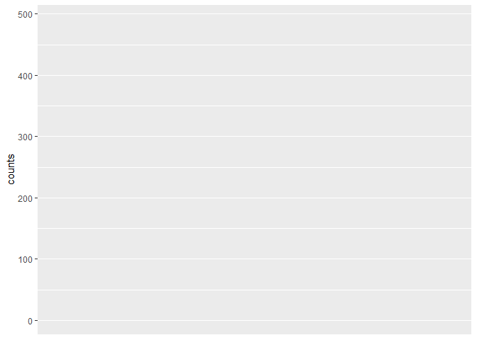
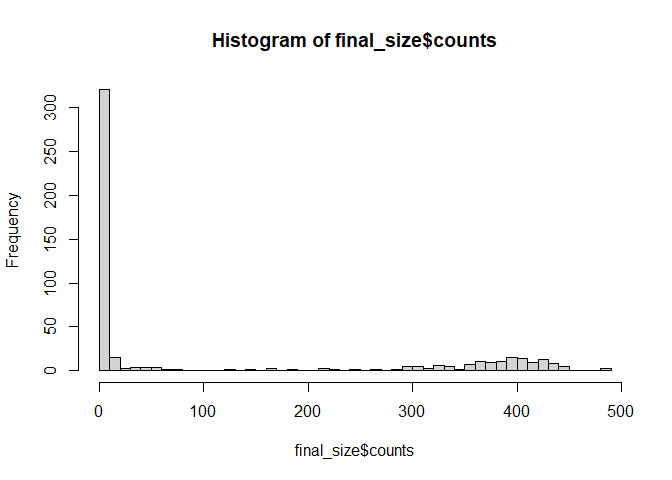

# Sensitivity Analysis


``` r
library(multigroup.vaccine)

pops <- c(60, 100, 500)

ode_size <- multigroup.vaccine:::getFinalSizeSim(
  R0 = 1.5,
  recoveryRate = 1 / 7,
  popsize = pops,
  initR = rep(0, 3),
  initI = c(1, 0, 0),
  initV = rep(0, 3),
  incontact = c(.8, .8, .8),
  relcontact = c(1, 1, 1),
  relsusc = c(1, 1, 1)
  )
```

``` r
library(epiworldR)

cmat <- matrix(
  c(0.8, 0.1, 0.1,
    0.1, 0.8, 0.1,
    0.1, 0.1, 0.8
    ),
  nrow = 3, byrow = TRUE
)

abm_model <- ModelSEIRMixing(
  name = "abc",
  n = sum(pops),
  prevalence = 1/sum(pops),
  contact_rate = 1.5 * (1/7) / .1,
  recovery_rate = 1 / 7,
  contact_matrix = cmat,
  transmission_rate = .1,
  incubation_days = 0
)

# Start off creating three entities.
# Individuals will be distribured randomly between the three.
e1 <- entity("Population 1", pops[1], as_proportion = FALSE)
e2 <- entity("Population 2", pops[2], as_proportion = FALSE)
e3 <- entity("Population 3", pops[3], as_proportion = FALSE)

abm_model |>
  add_entity(e1) |>
  add_entity(e2) |>
  add_entity(e3)

# Creating the saver
saver <- make_saver("total_hist", "reproductive")

# Running multiple simulations
set.seed(331)
run_multiple(m = abm_model, ndays = 200, nsims = 500, saver = saver, nthreads = 7)
```

    Starting multiple runs (500) using 7 thread(s)
    _________________________________________________________________________
    _________________________________________________________________________
    ||||||||||||||||||||||||||||||||||||||||||||||||||||||||||||||||||||||||| done.

``` r
library(data.table)
res <- run_multiple_get_results(abm_model)
total_hist <- res$total_hist |> 
  as.data.table()

library(ggplot2)
```

    Warning: package 'ggplot2' was built under R version 4.4.2

``` r
total_hist[date == 200 & state == "Recovered"] |>
  ggplot(aes(y = counts)) 
```



``` r
    geom_histogram()
```

    geom_bar: na.rm = FALSE, orientation = NA
    stat_bin: binwidth = NULL, bins = NULL, na.rm = FALSE, orientation = NA, pad = FALSE
    position_stack 

``` r
final_size <- total_hist[date == 200 & state != "Susceptible"]
final_size <- final_size[, .(counts = sum(counts)), by = "sim_num"]

final_size[counts >= 100, .(
    mean = mean(counts),
    sd = sd(counts),
    median = median(counts),
    lower = quantile(counts, probs = .025),
    upper = quantile(counts, probs = .975)
  )]
```

           mean       sd median lower upper
          <num>    <num>  <int> <num> <num>
    1: 366.8571 69.37115    385   167 447.7

``` r
hist(final_size$counts, breaks = 50)
```


