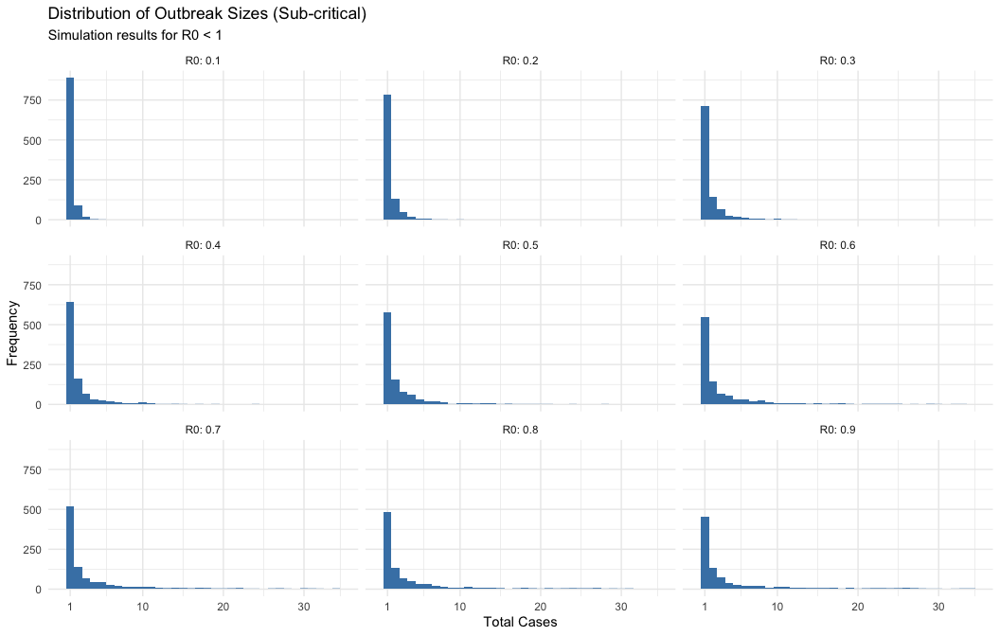
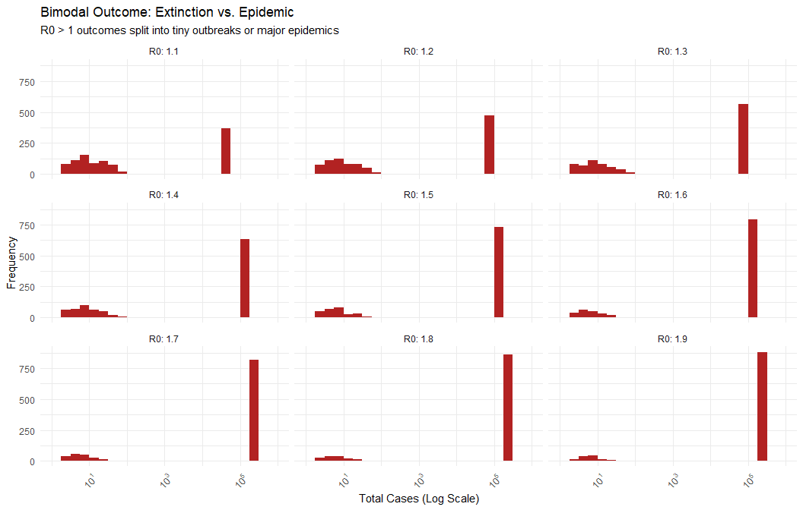
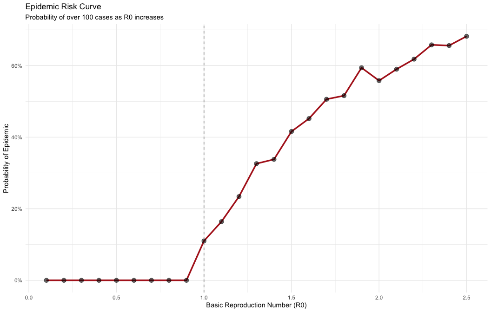
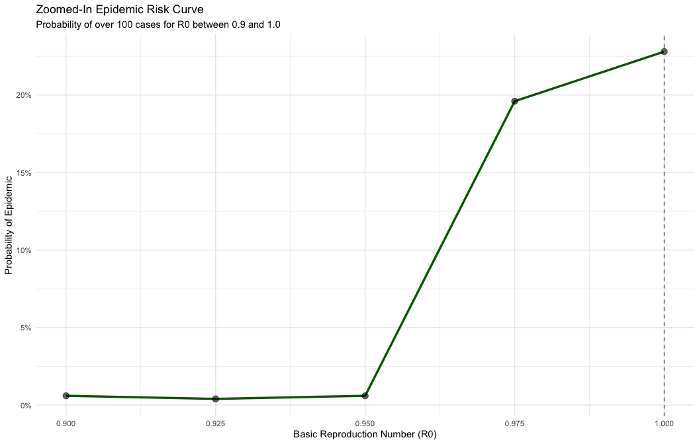

    library(multigroup.vaccine)
    library(socialmixr)

    library(data.table)
    library(ggplot2)

This vignette demonstrates an age-structured model of transmission
within Davis County, Utah.

First we define the age groups that we want use in our model. We define
the `age_limits` vector using the lower limit (minimum age) of each
group, starting with 0:

    # under 1, 1-4, 5-11, 12-13, 14-17, 18-24, 25-44, 45-69, 70 plus
    age_limits <- c(0, 1, 5, 12, 14, 18, 25, 45, 70)

Next we collect census data from Davis County, Utah, using our custom
age group choice:

    davis_data <- getCensusData(
      state_fips = getStateFIPS("Utah"),
      county_name = "Davis County",
      year = 2024,
      age_groups = age_limits,
      csv_path = getCensusDataPath()
    )

Now we specify immunity levels of our population age groups due to
vaccination and prior infection. Let’s assume no prior immunity to H5N1.

    age_immunity <- rep(0, length(age_limits))

Now we can begin defining the input arguments to our `finalsize`
function so that we can estimate the outbreak size in this county after
an introduction from a 13-year-old.

Initial population size of each disease state:

    popsize <- davis_data$age_pops

    initV <- round(age_immunity * popsize)  # initially immune cases 

    initI <- rep(0, length(popsize))  # initial infectious cases
    initI[4] <- 1                     # assume 1 initial case in the 4th age group (12-13)
    initI[3] <- 2                     # ... and 2 initial cases in the 3rd age group (5-11)
    initR <- rep(0, length(popsize))  # no recent prior H5 flu survivors

Transmission matrix ingredients: contact matrix, relative susceptibility
and transmissibility. The contact matrix uses Polymod contact survey
data, adjusted for local population distribution:

    contactmatrix <- contactMatrixPolymod(age_limits, popsize)
    relsusc <- rep(1, length(popsize))      # Assume no age differences in susceptibility
    reltransm <- rep(1, length(popsize))    # or transmissibility per contact

## Basic reproduction number.

H5 flu could have a low level of transmissibility with
*R*0 &lt; 1 - let’s see how outbreak sizes might look for a
range of 0.1 to 0.9. The results are from 1,000 simulations and show how
many of those simulations resulted in each number of total infections
(including the first one).

    # Define R0 values to inspect
    r0_low_vals <- c(0.5, 0.7, 0.9, 0.99)
    # Run simulations
    results_low <- do.call(rbind, lapply(r0_low_vals, function(r) {
      fs <- finalsize(popsize, r, contactmatrix, relsusc, reltransm, initR, initI, initV,
                      method = "stochastic", nsims = 1000)
      data.frame(R0 = as.factor(r), Cases = rowSums(fs))
    }))

    # Visualization: Fixed axis breaks to stop overlapping
    ggplot(results_low, aes(x = Cases)) +
      geom_bar(fill = "steelblue", width = 1) + # width=1 removes gaps between discrete integers
      facet_wrap(~R0, labeller = label_both) +
      scale_x_continuous(breaks = c(1, 10, 20, 30), limits = c(0, 35)) + 
      labs(title = "Distribution of Outbreak Sizes (Sub-critical)",
           subtitle = "Simulation results for R0 < 1",
           y = "Frequency",
           x = "Total Cases") +
      theme_minimal()
    #> Warning: Removed 566 rows containing non-finite outside the scale range
    #> (`stat_count()`).
    #> Warning: Removed 3 rows containing missing values or values outside the scale
    #> range (`geom_bar()`).

For a closer look at R0 = 0.5, here are the probabilities of different
outbreak sizes:

    # Show detailed probabilities for R0 = 0.5
    outbreak_tot <- results_low[results_low$R0 == "0.5", ]
    sizes <- c(1, 5, 10, 15, 20, 30, 50, 100)
    knitr::kable(
      data.table(
        "Size" = sizes,
        "P(Greater or equal)" = sapply(sizes, function(sz) mean(outbreak_tot$Cases >= sz)),
        "P(Less or equal)" = sapply(sizes, function(sz) mean(outbreak_tot$Cases <= sz))
      ),
      caption = "Probability of outbreak sizes for R0 = 0.5",
      digits = 2
    )

<table>
<caption>Probability of outbreak sizes for R0 = 0.5</caption>
<thead>
<tr>
<th style="text-align: right;">Size</th>
<th style="text-align: right;">P(Greater or equal)</th>
<th style="text-align: right;">P(Less or equal)</th>
</tr>
</thead>
<tbody>
<tr>
<td style="text-align: right;">1</td>
<td style="text-align: right;">1.00</td>
<td style="text-align: right;">0.00</td>
</tr>
<tr>
<td style="text-align: right;">5</td>
<td style="text-align: right;">0.57</td>
<td style="text-align: right;">0.55</td>
</tr>
<tr>
<td style="text-align: right;">10</td>
<td style="text-align: right;">0.17</td>
<td style="text-align: right;">0.86</td>
</tr>
<tr>
<td style="text-align: right;">15</td>
<td style="text-align: right;">0.08</td>
<td style="text-align: right;">0.93</td>
</tr>
<tr>
<td style="text-align: right;">20</td>
<td style="text-align: right;">0.03</td>
<td style="text-align: right;">0.97</td>
</tr>
<tr>
<td style="text-align: right;">30</td>
<td style="text-align: right;">0.01</td>
<td style="text-align: right;">0.99</td>
</tr>
<tr>
<td style="text-align: right;">50</td>
<td style="text-align: right;">0.00</td>
<td style="text-align: right;">1.00</td>
</tr>
<tr>
<td style="text-align: right;">100</td>
<td style="text-align: right;">0.00</td>
<td style="text-align: right;">1.00</td>
</tr>
</tbody>
</table>

If *R*0 &gt; 1, there could be a very large outbreak. We can
provide a quick estimate of outbreak sizes using our hybrid model:

    # Define R0 values to inspect
    r0_high_vals <- c(1.1, 1.2, 1.3, 1.4, 1.5, 1.6, 1.7, 1.8, 1.9)

    # Run simulations
    results_high <- do.call(rbind, lapply(r0_high_vals, function(r) {
      fs <- finalsize(popsize, r, contactmatrix, relsusc, reltransm, initR, initI, initV,
                      method = "hybrid", nsims = 1000)
      data.frame(R0 = as.factor(r), Cases = rowSums(fs))
    }))

    # Visualization: 3x3 Grid + Log Scale Bins
    ggplot(results_high, aes(x = Cases)) +
      # Manually define log-spaced breaks to ensure the histogram renders cleanly
      geom_histogram(breaks = 10^seq(0, 6, by = 0.25), fill = "firebrick") +
      facet_wrap(~R0, labeller = label_both, ncol = 3) + # Grid layout instead of vertical
      scale_x_log10(labels = scales::trans_format("log10", scales::math_format(10^.x))) + 
      labs(title = "Bimodal Outcome: Extinction vs. Epidemic",
           subtitle = "R0 > 1 outcomes split into tiny outbreaks or major epidemics",
           y = "Frequency",
           x = "Total Cases (Log Scale)") +
      theme_minimal() +
      theme(axis.text.x = element_text(angle = 45, hjust = 1))

For R0 = 1.5, here are the probabilities across different outbreak
sizes:

    # Show detailed probabilities for R0 = 1.5
    outbreak_tot <- results_high[results_high$R0 == "1.5", ]
    sizes <- c(10, 20, 50, 100, 200, 500, 1000, 2000)
    knitr::kable(
      data.table(
        "Size" = sizes,
        "P(Greater or equal)" = sapply(sizes, function(sz) mean(outbreak_tot$Cases >= sz)),
        "P(Less or equal)" = sapply(sizes, function(sz) mean(outbreak_tot$Cases <= sz))
      ),
      caption = "Probability of outbreak sizes for R0 = 1.5",
      digits = 2
    )

<table>
<caption>Probability of outbreak sizes for R0 = 1.5</caption>
<thead>
<tr>
<th style="text-align: right;">Size</th>
<th style="text-align: right;">P(Greater or equal)</th>
<th style="text-align: right;">P(Less or equal)</th>
</tr>
</thead>
<tbody>
<tr>
<td style="text-align: right;">10</td>
<td style="text-align: right;">0.82</td>
<td style="text-align: right;">0.19</td>
</tr>
<tr>
<td style="text-align: right;">20</td>
<td style="text-align: right;">0.77</td>
<td style="text-align: right;">0.23</td>
</tr>
<tr>
<td style="text-align: right;">50</td>
<td style="text-align: right;">0.74</td>
<td style="text-align: right;">0.26</td>
</tr>
<tr>
<td style="text-align: right;">100</td>
<td style="text-align: right;">0.74</td>
<td style="text-align: right;">0.26</td>
</tr>
<tr>
<td style="text-align: right;">200</td>
<td style="text-align: right;">0.74</td>
<td style="text-align: right;">0.26</td>
</tr>
<tr>
<td style="text-align: right;">500</td>
<td style="text-align: right;">0.74</td>
<td style="text-align: right;">0.26</td>
</tr>
<tr>
<td style="text-align: right;">1000</td>
<td style="text-align: right;">0.74</td>
<td style="text-align: right;">0.26</td>
</tr>
<tr>
<td style="text-align: right;">2000</td>
<td style="text-align: right;">0.74</td>
<td style="text-align: right;">0.26</td>
</tr>
</tbody>
</table>

## Other Diagrams

    # Calculate the probability of over 100 cases across a range of R0 values
    r0_range <- seq(0.1, 2.5, by = 0.1)
    risk_data <- do.call(rbind, lapply(r0_range, function(r) {
      # Run 1000 simulations per R0
      fs <- finalsize(popsize, r, contactmatrix, relsusc, reltransm, initR, initI, initV,
                      method = "hybrid", nsims = 1000)

      # Calculate proportion of runs that have over 100 cases
      prob_epidemic <- mean(rowSums(fs) > 100)

      data.frame(R0 = r, Probability = prob_epidemic)
    }))

    # Plot the Sigmoid Risk Curve
    ggplot(risk_data, aes(x = R0, y = Probability)) +
      geom_line(color = "firebrick", size = 1.2) +
      geom_point(size = 3, alpha = 0.6) +
      # Add a reference line where risk begins to skyrocket
      geom_vline(xintercept = 1.0, linetype = "dashed", color = "gray50") +
      scale_y_continuous(labels = scales::percent) +
      labs(title = "Epidemic Risk Curve",
           subtitle = "Probability of over 100 cases as R0 increases",
           y = "Probability of Epidemic",
           x = "Basic Reproduction Number (R0)") +
      theme_minimal()

### Zoomed-in R0 Curve

Let’s look at the 0.7 to 1.3 range in more detail:

    # Zoomed-in R0 range
    r0_zoom <- seq(0.9, 1.0, by = 0.025)
    risk_data_zoom <- do.call(rbind, lapply(r0_zoom, function(r) {
      # Run 500 simulations per R0
      fs <- finalsize(popsize, r, contactmatrix, relsusc, reltransm, initR, initI, initV,
                      method = "hybrid", nsims = 500)

      # Calculate proportion of runs that have over 100 cases
      prob_epidemic <- mean(rowSums(fs) > 100)

      data.frame(R0 = r, Probability = prob_epidemic)
    }))

    # Plot the Zoomed-in Risk Curve
    ggplot(risk_data_zoom, aes(x = R0, y = Probability)) +
      geom_line(color = "darkgreen", size = 1.2) +
      geom_point(size = 3, alpha = 0.6) +
      geom_vline(xintercept = 1.0, linetype = "dashed", color = "gray50") +
      scale_y_continuous(labels = scales::percent) +
      labs(title = "Zoomed-In Epidemic Risk Curve",
           subtitle = "Probability of over 100 cases for R0 between 0.9 and 1.0",
           y = "Probability of Epidemic",
           x = "Basic Reproduction Number (R0)") +
      theme_minimal()

