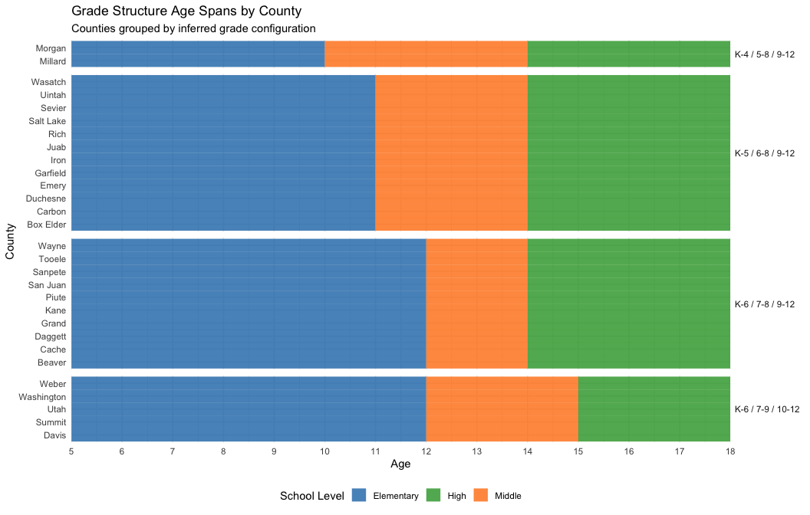
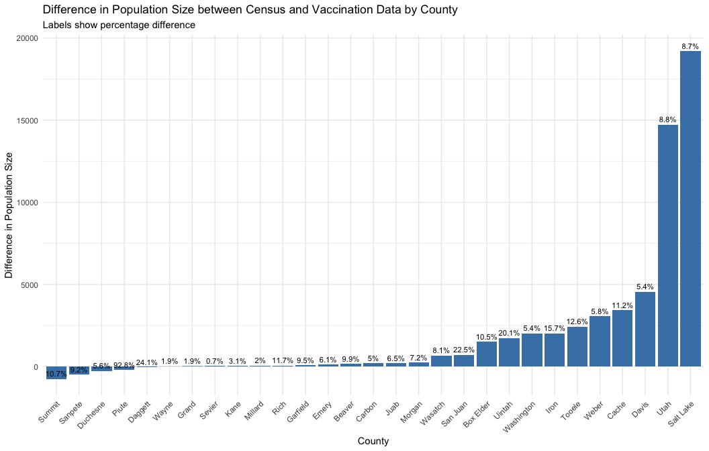
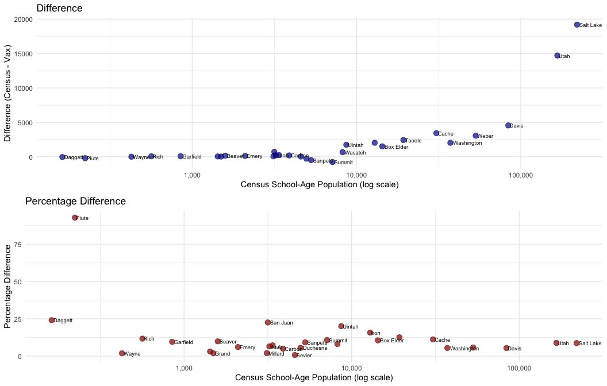

    library(multigroup.vaccine)
    library(socialmixr)
    library(ggplot2)

    verbose <- FALSE  # Set to TRUE to enable detailed logging during processing

# Age-Structured UT County Model

This vignette is an experimental vignette in which we build and run an
age-structured model of transmission within Utah on a county-level
resolution.

WARNING: The data and model used in this vignette are for demonstration
purposes only and do not reflect real-world conditions accurately. The
results are not intended to forecast or predict a measles outbreak size
in this location.

## Age Structures

First, define the age groups for our model.

Because each county has a different school vax distribution, we need to
use the same age groups as the school vax distribution for a given
county. In the vaccination data (county\_vax\_data.csv), the vaccination
data is organized by **school** level (1=el, 2=middle, 3=high).

**Important methodological note on grade structure assumptions:**

School grade structures in Utah are determined at the **district
level**, not county level. Within a single county, different districts
may use different configurations (e.g., some K-5/6-8/9-12, others
K-6/7-9/10-12). However, our vaccination data is aggregated at the
**county level**.

For modeling purposes, we make the following **simplifying
assumptions**:

1.  **County-level aggregation is acceptable**: Since our vaccination
    data is county-aggregated, we treat each county as having a
    *dominant grade structure*
2.  **Population ratios reveal dominant patterns**: We use the relative
    sizes of elementary/middle/high school populations to infer the most
    common grade configuration in that county
3.  **Age groups approximate school levels**: Our age groups are
    designed to roughly align with school levels, acknowledging that
    exact grade-to-age mapping varies by district policies

This approach works best for counties with relatively uniform district
structures. Counties with highly heterogeneous district structures may
require manual overrides based on demographic research.

### Heuristics

For the first (somewhat naive approach), we will use the *ratio* of the
school populations to determine the age groups.

**Inference heuristic for age groups based on population ratios:**

The logic uses population ratios to infer grade structures: - If middle
≈ 50% of high: Middle likely 2 grades (7-8) → elementary = K-6 - If
middle ≈ 75% of high: Middle likely 3 grades (6-8) → elementary = K-5 -
If middle ≈ high (ratio 80%-120%): - if elementary is much smaller than
middle (ratio &lt;0.5): likely K-4 for elementary, which supports
4-grade structures for middle and high (5-8, 9-12) - if elementary is
larger than middle (ratio &gt;0.5): likely K-6 for elementary, which
supports 3-grade structures for middle and high (7-9, 10-12) (ie: Weber
County fits this pattern)

**Limitations of this heuristic:** - Assumes uniform grade structure
across all districts within a county - Does not account for charter
schools or alternative school configurations - Students enrolled in
*online* schools may not be captured accurately in the population
ratios - Population ratios may be influenced by factors other than grade
spans (e.g., demographic patterns, school choice) - Manual overrides can
be added for counties where specific district information is known (for
example, Millard County has a known K-4/5-8/9-12 structure based on
district data)

**Manual overrides:** For counties with verified grade structures that
differ from the heuristic inference, add them to the `manual_overrides`
list in the code below.

    county_vax_data <- read.csv(file.path("../../data-raw/county_vax_data.csv"))

    age_groups_by_county <- list()

    # Get unique counties
    unique_counties <- unique(county_vax_data$county)

    for (county_name in unique_counties) {
      # Extract data for this county
      county_data <- county_vax_data[county_vax_data$county == county_name, ]
      
      # Get population for each level
      el_pop <- county_data$pop[county_data$level == 1]
      middle_pop <- county_data$pop[county_data$level == 2]
      high_pop <- county_data$pop[county_data$level == 3]
      
      if (verbose) {
        print(paste("Processing county:", county_name))
        print(paste("Elementary pop:", el_pop, "Middle pop:", middle_pop, "High pop:", high_pop))
      }
      
      # Some counties have more unique structures, so we can define manual overrides for those based on known district configurations
      # This is especially important for rural counties.
      manual_overrides <- list(
        # Example:
        # "Millard" = list(
        #   ages = c(0, 5, 10, 14, 18, 25, 45, 70),
        #   reason = "K-4 elementary, 5-8 middle, 9-12 high (verified from district data)"
        # )
      )

      # Check for manual override first
      if (county_name %in% names(manual_overrides)) {
        override <- manual_overrides[[county_name]]
        age_groups_by_county[[county_name]] <- override$ages
        if (verbose) {
          print(paste("  -> Using manual override:", override$reason))
          print(paste("     Ages:", paste(override$ages, collapse=", ")))
        }
      } else if (length(middle_pop) > 0 && length(high_pop) > 0 && high_pop > 0) {
        # Use population ratio to determine age structure
        middle_to_high_ratio <- middle_pop / high_pop
        el_to_middle_ratio <- if(length(el_pop) > 0 && middle_pop > 0) el_pop / middle_pop else NA

        if (verbose) {
          print(paste("Middle to high ratio:", round(middle_to_high_ratio, 3)))
          if (!is.na(el_to_middle_ratio)) {
            print(paste("Elementary to middle ratio:", round(el_to_middle_ratio, 3)))
          }
        }

        # logic to detect different grade structures
        if (middle_to_high_ratio >= 0.8 && middle_to_high_ratio <= 1.2) {  # 1.2 is used to provide 'padding' for small population noise
          # if the elementary to middle ratio is low (e.g., <1.3), it may indicate a K-4 structure for elementary, which would further support the 4-grade inference for middle and high
          # however, if the elementary to middle ratio is higher (e.g., >1.3), it may indicate a K-6 structure for elementary, which would suggest a 3-grade structure for middle (7-9) and 3-grade for high (10-12)
          if (!is.na(el_to_middle_ratio) && el_to_middle_ratio < 1.3) {
            # Elementary is much smaller than middle → likely K-4
            # Suggests: Elementary K-4, Middle 5-8, High 9-12
            age_groups_by_county[[county_name]] <- c(0, 1, 5, 10, 14, 18, 25, 45, 70)
            if (verbose) print("  -> Using ages: 0, 1, 5, 10, 14, 18, 25, 45, 70 (inferred: el=K-4, middle=5-8, high=9-12)")
          } else {
            # Elementary is larger than middle → likely K-6
            # Suggests: Elementary K-5, Middle 7-9, High 10-12
            age_groups_by_county[[county_name]] <- c(0, 1, 5, 12, 15, 18, 25, 45, 70)
            if (verbose) print("  -> Using ages: 0, 1, 5, 12, 15, 18, 25, 45, 70 (inferred: el=K-5, middle=7-9, high=10-12)")
          }
        } else if (middle_to_high_ratio <= 0.6) {
          # Middle is ~50% of high → middle likely 2 grades (7-8)
          # Suggests: Elementary K-6, Middle 7-8, High 9-12
          age_groups_by_county[[county_name]] <- c(0, 1, 5, 12, 14, 18, 25, 45, 70)
          if (verbose) print("  -> Using ages: 0, 1, 5, 12, 14, 18, 25, 45, 70 (inferred: el=K-6, middle=7-8, high=9-12)")
        } else {
          # Middle is ~60-80% of high → middle likely 3 grades (6-8)
          # Suggests: Elementary K-5, Middle 6-8, High 9-12
          age_groups_by_county[[county_name]] <- c(0, 1, 5, 11, 14, 18, 25, 45, 70)
          if (verbose) print("  -> Using ages: 0, 1, 5, 11, 14, 18, 25, 45, 70 (inferred: el=K-5, middle=6-8, high=9-12)")
        }
      } else {
        # Default if data is missing
        age_groups_by_county[[county_name]] <- c(0, 1, 5, 11, 14, 18, 25, 45, 70)
        if (verbose) print("  -> Using default ages: 0, 1, 5, 11, 14, 18, 25, 45, 70")
      }
      if (verbose) print("")
    }

    if (verbose) {
      print("Age groups by county:")
      print(age_groups_by_county)
      
      print("Number of counties processed:")
      print(length(age_groups_by_county))
    }

    # One of the 'counties' is Online, which represents online schools in UT.
    # Remove that county from the list and save it as a separate variable
    online_schools_age_groups <- age_groups_by_county$Online
    age_groups_by_county$Online <- NULL

    if (verbose) {
      print("Age groups for online schools:")
      print(online_schools_age_groups)
    }

Now get all counties from Utah, passing in the age groups for each
county as defined above:

    # get all counties from Utah using getAllCountiesData with county-specific age groups
    # data is pre-saved as csv in data-raw
    utah_counties <- getAllCountiesData(
      state_fips = getStateFIPS("Utah"),
      year = 2024,
      age_groups_by_county = age_groups_by_county,
      csv_path = getCensusDataPath(),
      verbose = verbose
    )

    # Display the names of all counties
    names(utah_counties)
    #>  [1] "Beaver County"     "Box Elder County"  "Cache County"     
    #>  [4] "Carbon County"     "Daggett County"    "Davis County"     
    #>  [7] "Duchesne County"   "Emery County"      "Garfield County"  
    #> [10] "Grand County"      "Iron County"       "Juab County"      
    #> [13] "Kane County"       "Millard County"    "Morgan County"    
    #> [16] "Piute County"      "Rich County"       "Salt Lake County" 
    #> [19] "San Juan County"   "Sanpete County"    "Sevier County"    
    #> [22] "Summit County"     "Tooele County"     "Uintah County"    
    #> [25] "Utah County"       "Wasatch County"    "Washington County"
    #> [28] "Wayne County"      "Weber County"

    # Show example data from one county
    if (verbose) {
      print("Example county data:")
      print(utah_counties[[1]])
    }

    # Categorize each county by its age group structure
    # Extract the school-age portions (indices 3-5) to identify the structure type
    structure_df <- data.frame(
      county = character(),
      structure_type = character(),
      el_start = numeric(),
      el_end = numeric(),
      middle_start = numeric(),
      middle_end = numeric(),
      high_start = numeric(),
      high_end = numeric(),
      stringsAsFactors = FALSE
    )

    for (county_name in names(age_groups_by_county)) {
      ages <- age_groups_by_county[[county_name]]

      # School age groups are typically at indices 3, 4, 5, 6
      # (after 0, 1, and the first school boundary)
      # For visualization, we want segments to connect, so end points should equal the next start point
      el_start <- ages[3]
      el_end <- ages[4]  # This connects to middle_start
      middle_start <- ages[4]
      middle_end <- ages[5]  # This connects to high_start
      high_start <- ages[5]
      high_end <- ages[6]  # This is the final boundary

      # Categorize based on the age structure
      if (identical(ages, c(0, 1, 5, 10, 14, 18, 25, 45, 70))) {
        structure_type <- "K-4 / 5-8 / 9-12"
      } else if (identical(ages, c(0, 1, 5, 12, 15, 18, 25, 45, 70))) {
        structure_type <- "K-6 / 7-9 / 10-12"
      } else if (identical(ages, c(0, 1, 5, 12, 14, 18, 25, 45, 70))) {
        structure_type <- "K-6 / 7-8 / 9-12"
      } else if (identical(ages, c(0, 1, 5, 11, 14, 18, 25, 45, 70))) {
        structure_type <- "K-5 / 6-8 / 9-12"
      } else {
        structure_type <- "Other"
      }

      structure_df <- rbind(structure_df, data.frame(
        county = gsub(" County", "", county_name),
        structure_type = structure_type,
        el_start = el_start,
        el_end = el_end,
        middle_start = middle_start,
        middle_end = middle_end,
        high_start = high_start,
        high_end = high_end
      ))
    }

    # Count by structure type
    structure_counts <- table(structure_df$structure_type)
    print("Distribution of grade structures:")
    #> [1] "Distribution of grade structures:"
    print(structure_counts)
    #> 
    #>  K-4 / 5-8 / 9-12  K-5 / 6-8 / 9-12  K-6 / 7-8 / 9-12 K-6 / 7-9 / 10-12 
    #>                 2                12                10                 5

    # Create a visual showing the grade spans for each county
    library(tidyr)
    library(dplyr)

    # Reshape data for plotting - create one row per county per school level
    structure_long <- rbind(
      structure_df %>% select(county, structure_type, start = el_start, end = el_end) %>% mutate(level = "Elementary"),
      structure_df %>% select(county, structure_type, start = middle_start, end = middle_end) %>% mutate(level = "Middle"),
      structure_df %>% select(county, structure_type, start = high_start, end = high_end) %>% mutate(level = "High")
    )

    # Order counties by structure type and then alphabetically
    structure_long <- structure_long %>%
      arrange(structure_type, county) %>%
      mutate(county = factor(county, levels = unique(county)))

    # Plot showing grade spans for each county
    ggplot(structure_long, aes(y = county)) +
      geom_segment(aes(x = start, xend = end, yend = county, color = level), 
                   size = 6, alpha = 0.8) +
      scale_color_manual(values = c("Elementary" = "#1f77b4", 
                                      "Middle" = "#ff7f0e", 
                                      "High" = "#2ca02c")) +
      scale_x_continuous(breaks = seq(0, 20, by = 1), expand = c(0, 0)) +
      facet_grid(structure_type ~ ., scales = "free_y", space = "free_y") +
      labs(
        title = "Grade Structure Age Spans by County",
        subtitle = "Counties grouped by inferred grade configuration",
        x = "Age",
        y = "County",
        color = "School Level"
      ) +
      theme_minimal() +
      theme(
        strip.text.y = element_text(angle = 0, hjust = 0),
        legend.position = "bottom"
      )

### Difference between Vax and Census data

There is a non-negligible difference between the census 2024 estimate
age-grouping population sizes and the population sizes from the
vaccination data.

This could be due to a variety of external factors.

To understand this difference, we can compare the processed
age-groupings and the population sizes from the vaccination data for
every county.

    county_difference <- data.frame(
      county = character(),
      census_population = numeric(),
      vax_population = numeric(),
      difference = numeric(),
      stringsAsFactors = FALSE
    )

    # For every county, compute the difference at each age group between the census population and the vaccination data population
    for (county_name in names(utah_counties)) {
      census_data <- utah_counties[[county_name]]

      # Remove " County" from the county name to match the format in the vaccination data
      county_name <- gsub(" County", "", county_name)
      vax_data <- county_vax_data[county_vax_data$county == county_name, ]

      if (verbose) print(paste("County:", county_name))

      # Get the population sizes for the school age groups from the census data and the vaccination data
      census_age_1 <- census_data$age_labels[3]  # age group corresponding to the first school age group (e.g., 1-4 or 1-5)
      census_age_2 <- census_data$age_labels[4]  # age group corresponding to the second school age group (e.g., 5-11 or 6-11)
      census_age_3 <- census_data$age_labels[5]  # age group corresponding to the third school age group (e.g., 12-17)

      census_pop <- census_data$age_pops[census_data$age_labels %in% c(census_age_1, census_age_2, census_age_3)]

      vax_pop <- c(vax_data$pop[vax_data$level == 1], vax_data$pop[vax_data$level == 2], vax_data$pop[vax_data$level == 3])

      difference <- sum(census_pop) - sum(vax_pop)

      county_difference <- rbind(county_difference, data.frame(
        county = county_name,
        census_population = sum(census_pop),
        vax_population = sum(vax_pop),
        difference = difference
      ))

      if (verbose) {
        print(paste("County:", county_name))
        print(paste("Census population:", sum(census_pop), "Vax population:",
                    sum(vax_pop), "Difference:", sum(census_pop) - sum(vax_pop)))
        print("")
      }
    }

    print(county_difference)
    #>        county census_population vax_population difference
    #> 1      Beaver              1588           1431        157
    #> 2   Box Elder             14336          12825       1511
    #> 3       Cache             30609          27180       3429
    #> 4      Carbon              3894           3700        194
    #> 5     Daggett               162            201        -39
    #> 6       Davis             83912          79361       4551
    #> 7    Duchesne              4953           5230       -277
    #> 8       Emery              2097           1970        127
    #> 9    Garfield               849            768         81
    #> 10      Grand              1497           1469         28
    #> 11       Iron             12897          10866       2031
    #> 12       Juab              3227           3017        210
    #> 13       Kane              1429           1385         44
    #> 14    Millard              3119           3057         62
    #> 15     Morgan              3377           3134        243
    #> 16      Piute               223            430       -207
    #> 17       Rich               564            498         66
    #> 18  Salt Lake            219984         200784      19200
    #> 19   San Juan              3159           2447        712
    #> 20    Sanpete              5285           5773       -488
    #> 21     Sevier              4585           4552         33
    #> 22     Summit              7136           7901       -765
    #> 23     Tooele             19282          16855       2427
    #> 24     Uintah              8668           6929       1739
    #> 25       Utah            166768         152054      14714
    #> 26    Wasatch              8222           7554        668
    #> 27 Washington             37254          35224       2030
    #> 28      Wayne               426            418          8
    #> 29      Weber             53140          50081       3059

    county_difference$total_population <- county_difference$census_population
    county_difference$percent_difference <- abs((county_difference$difference / county_difference$census_population) * 100)

    # Bar chart: absolute difference in population size between census and vaccination data for each county
    ggplot(county_difference, aes(x = reorder(county, difference), y = difference)) +
      geom_bar(stat = "identity", fill = "steelblue") +
      geom_text(aes(label = paste0(round(percent_difference, 1), "%")), vjust = -0.5, size = 3) +
      labs(
        title = "Difference in Population Size between Census and Vaccination Data by County",
        subtitle = "Labels show percentage difference",
        x = "County",
        y = "Difference in Population Size"
      ) +
      theme_minimal() +
      theme(axis.text.x = element_text(angle = 45, hjust = 1))

    # Two-panel view showing both absolute and percentage differences
    library(gridExtra)
    p1 <- ggplot(county_difference, aes(x = total_population, y = difference)) +
      geom_point(color = "darkblue", size = 3, alpha = 0.7) +
      geom_text(aes(label = county), hjust = -0.1, vjust = 0.5, size = 2.5, check_overlap = TRUE) +
      scale_x_log10(labels = comma) +
      labs(
        title = "Difference",
        x = "Census School-Age Population (log scale)",
        y = "Difference (Census - Vax)"
      ) +
      theme_minimal()

    p2 <- ggplot(county_difference, aes(x = total_population, y = percent_difference)) +
      geom_point(color = "darkred", size = 3, alpha = 0.7) +
      geom_text(aes(label = county), hjust = -0.1, vjust = 0.5, size = 2.5, check_overlap = TRUE) +
      scale_x_log10(labels = comma) +
      labs(
        title = "Percentage Difference",
        x = "Census School-Age Population (log scale)",
        y = "Percentage Difference"
      ) +
      theme_minimal()

    grid.arrange(p1, p2, ncol = 1)

